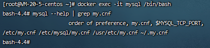
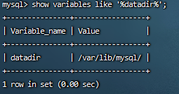
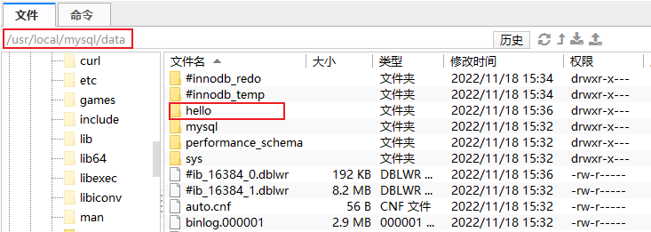

docker 安装mysql并挂载


### 1.安装指定最新或指定版本

[https://hub.docker.com/_/mysql/tags](https://hub.docker.com/_/mysql/tags)

```shell
docker pull mysql:latest
```

### 2.启动mysql容器

```shell
# 运行mysql命名容器名称为mysql并且设置root账号初始密码为root
docker run  -p 3306:3306 --name mysql -e MYSQL_ROOT_PASSWORD="root" -d mysql
```

### 3.确定mysql配置文件路径

```shell
#进入docker容器，mysql为刚安装的容器名称
docker exec -it mysql或者mysql容器ID /bin/bash
 
# 查找Docker内，MySQL配置文件my.cnf的位置
mysql --help | grep my.cnf
 
# 会输出数据文件的存放路径 /var/lib/mysql/
show variables like '%datadir%';
```





### 4.创建挂载目录 并复制配置文件

```shell
mkdir -p /usr/local/mysql/conf && mkdir -p /usr/local/mysql/data


# 将容器的配置复制到挂载目录
docker cp mysql:/etc/* /usr/local/mysql/conf/
或
docker cp mysql:/etc/. /usr/local/mysql/conf/
```

### 5.区分大小写(<font color=red>mysql8必须在初始化时配置</font>)

*可以删除data目录，重新初始化。*

```sh
vi /usr/local/mysql/conf/my.cnf
```

在[mysqld]下添加参数

`lower_case_table_names=1`

### 6.启动命令挂载

```sh
docker run  -p 3306:3306 --name mysql --network mysql-net -v /usr/local/mysql/conf/my.cnf:/etc/my.cnf -v /usr/local/mysql/data:/var/lib/mysql -v /usr/local/mysql/logs:/logs -e MYSQL_ROOT_PASSWORD="root" -d mysql
```

### 7.查看挂载



建库测试，挂载成功

