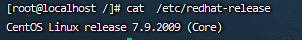

title: docker安装
date: 2025-06-17
tags: [docker]

## docker安装

*使用环境：CentOS7*

> Docker 要求CentOS系统内核版本高于3.10

命令查看内核版本

```
uname -r  # 当前版本 3.10.0-1160.el7.x86_64
```

[官方文档](https://docs.docker.com/engine/install/centos/)

### 一.在线安装

#### 1.更新 `yum`包

```shell
yum update
```

#### 2.卸载旧版`docker`(有的话)

```shell
yum remove docker \
            docker-client \
            docker-client-latest \
            docker-common \
            docker-latest \
            docker-latest-logrotate \
            docker-logrotate \
            docker-engine-selinux \
            docker-engine \
            docker-ce
```

#### 3.安装所需依赖

```
yum -y install yum-utils device-mapper-persistent-data lvm2
```

#### 4. 指定 Docker 镜像源，使用阿里云加速

```
yum-config-manager --add-repo http://mirrors.aliyun.com/docker-ce/linux/centos/docker-ce.repo
```

####  5.安装`Docker`

```shell
yum -y install docker-ce
```

安装docker可能出现如下问题

```
 Error: Package: containerd.io-1.6.33-3.1.el7.x86_64 (docker-ce-stable)
           Requires: container-selinux >= 2:2.74
Error: Package: docker-ce-rootless-extras-26.1.4-1.el7.x86_64 (docker-ce-stable)
           Requires: slirp4netns >= 0.4
Error: Package: 3:docker-ce-26.1.4-1.el7.x86_64 (docker-ce-stable)
           Requires: container-selinux >= 2:2.74
Error: Package: docker-ce-rootless-extras-26.1.4-1.el7.x86_64 (docker-ce-stable)
           Requires: fuse-overlayfs >= 0.7
 You could try using --skip-broken to work around the problem
 You could try running: rpm -Va --nofiles --nodigest
```

**解决办法：**

```yacas
wget -O /etc/yum.repos.d/CentOS-Base.repo http://mirrors.aliyun.com/repo/Centos-7.repo
 
yum clean all
yum makecache
```

#### 6.启动`Docker`

```shell
docker -v #查看版本
systemctl start docker #启动
systemctl enable docker #开机自动启动
docker run hello-world
```

出现如下错误

```
Unable to find image 'hello-world:latest' locally
docker: Error response from daemon: Get "https://registry-1.docker.io/v2/": dial tcp 65.49.26.98:443: i/o timeout.
```

**解决办法**

vi /etc/docker/daemon.json

```
{
    "registry-mirrors": [
        "https://docker.m.daocloud.io",
        "https://docker.imgdb.de",
        "https://docker-0.unsee.tech",
        "https://docker.hlmirror.com"
    ]
}
```

修改完后重启就可以了

```bash
systemctl daemon-reload
systemctl restart docker
```


#### 卸载docker

```shell
#停止服务

systemctl stop docker

#卸载yum安装的软件

yum remove docker-ce docker-ce-cli containerd.io

#删除本地文件

rm -rf /var/lib/docker
rm -rf /var/lib/containerd
```


### 二.离线安装

```shell
#查看centos版本
cat  /etc/redhat-release
```



使用软件包安装，下载合适安装包

下载地址：[https://download.docker.com/linux/centos/](https://download.docker.com/linux/centos/)  `x86_64/stable/Packages/`


**其他：tag安装**

下载地址：https://download.docker.com/linux/static/stable/x86_64/

安装参考：https://blog.csdn.net/fy512/article/details/123257474

### docker自启

```
# 开启 docker 自启动
systemctl enable docker.service

# 关闭 docker 自启动
systemctl disable docker.service
```


### docker容器自启

```shell
# 开启容器自启动
docker update --restart=always 【容器名】
例如：docker update --restart=always tracker


# 关闭容器自启动
docker update --restart=no【容器名】
例如：docker update --restart=no tracker

##### 相关配置解析
no：不自动重启容器。（默认）

on-failure： 如果容器由于错误而退出，则重新启动容器，该错误表现为非零退出代码。

always：如果容器停止，请务必重启容器。如果手动停止，则仅在Docker守护程序重新启动或手动重新启动容器本身时才重新启动。（参见重启政策详情中列出的第二个项目）

unless-stopped：类似于always，除了当容器停止（手动或其他方式）时，即使在Docker守护程序重新启动后也不会重新启动容器。
```


