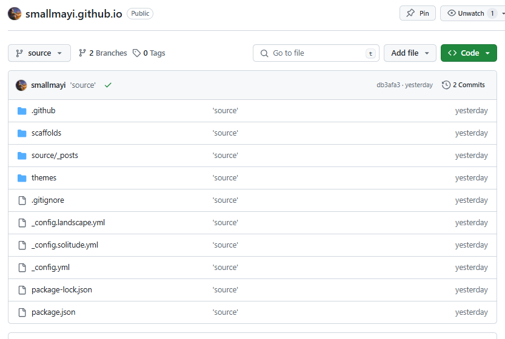
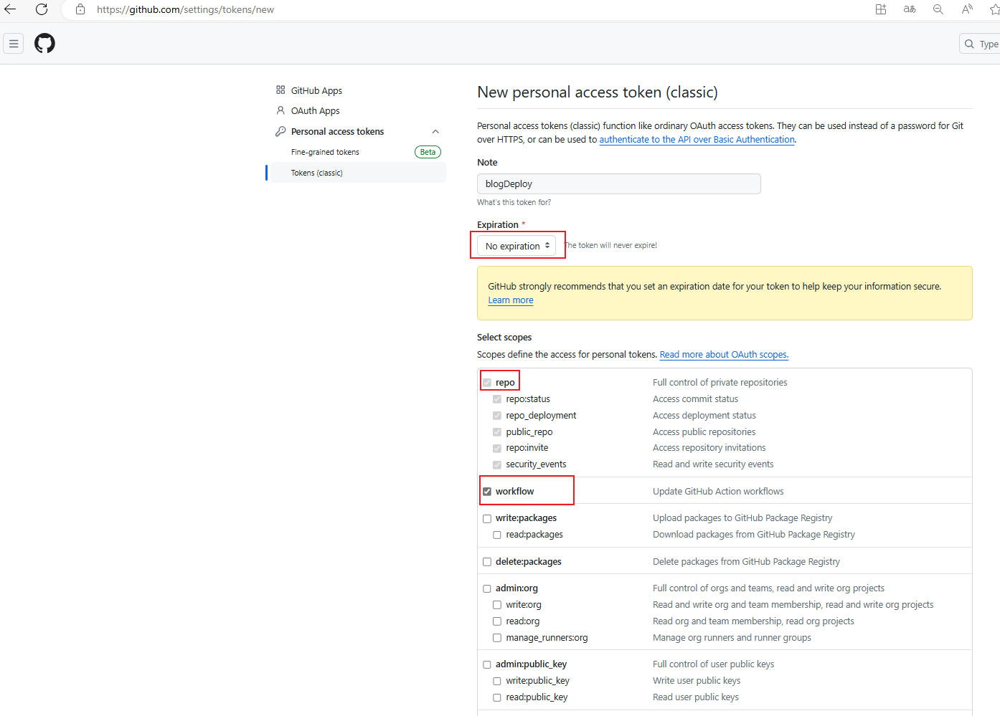
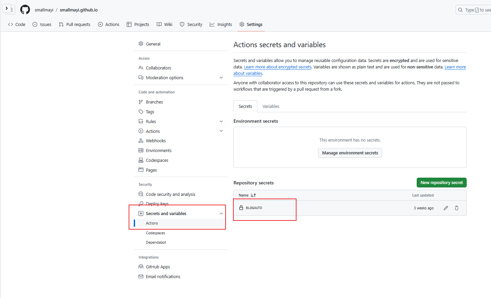

前面我们通过`hexo d`只是将生成的静态文件推送到我们指定的分支，但是我们的源码该如何管理。

### 1.在github仓库创建新分支source（分支名自定义）
新分支来源于之前的main分支，会有之前的文件代码。我们主要是想在这个分支管理源码

在setting里将默认分支切换成新建的分支source,这样我们git clone 时拉取的就是源码了。

### 2.将本地hexo目录与远程仓库关联

1)git init

如果要取消初始化，直接删除.git文件夹

2)添加远程地址，使用ssh方式。

使用https方式后续push时需要验证用户名密码，git已不支持这种方式验证。如果已添加远程库，可以用

`git remote rm origin` 去除远程库。

`git remote add origin git@github.com:smallmayi/smallmayi.github.io.git`

3)添加`.gitignore`文件，只保留源码，其他不推送

```
`.DS_STORE`
`db.json`
`*.log
node_modules/
public/
.deploy*/`
```

3)git add .
4)提交远程source分支

git push origin source

提交失败，因为之前远程的souce分支是我们直接从main分支复制的，和我们现在要提交的差异过大(因为我们不是拉取远程进行修改的，我们也不需要pull)，强制推送

`git push origin source --force`

5）查看仓库



可以看到已成功提交，且已经忽略生成的public文件夹。

2.使用git action

上面我们提交了源码和页面，但是每次写了文章我们需要手动hexo d 推送生成的页面，使用git action自动执行实现我们推送源码后自动执行生成页面。

1.生成个人token

https://github.com/settings/tokens



选择不过期，勾选repo和workflow

生成的token记得复制保存下来，只能看这一次。

2）添加自定义token



在setting下添加一个自定义secret,名称自定义，内容为之前的token。

3）去Github的自己仓库点击Actions，新建一个workflow工作流。

里面的依赖等根据情况配置

```yaml
name: Deploy Hexo to GitHub Pages

on:
  push:
    branches:
      - source  # 当推送到 source 分支时触发

jobs:
  build:
    runs-on: ubuntu-latest

    steps:
      - name: Checkout repository
        uses: actions/checkout@v2
        with:
          submodules: false  # 禁用子模块检查
          
      - name: Setup Node.js
        uses: actions/setup-node@v2
        with:
          node-version: '18'

      - name: Install Dependencies
        run: npm install

      - name: Install Hexo Git Deployer
        run: |
          npm install hexo-deployer-git --save
          npm install hexo-cli -g
          npm install hexo-renderer-pug hexo-renderer-stylus --save
      - name: Clean and Generate Static Files
        run: |
          hexo clean
          hexo generate
      - name: Configure Git
        run: |
          git config --global user.name 'smallmayi'
          git config --global user.email '1591698916@qq.com'
      - name: Deploy to GitHub Pages
        env:
          GH_TOKEN: ${{ secrets.BLOGAUTO }}
        run: |
          cd public/
          git init
          git add -A
          git commit -m "update by workflows"
          git remote add origin https://${{ secrets.BLOGAUTO }}@github.com/smallmayi/smallmayi.github.io.git
          git push origin HEAD:main -f
```


现在就配置好了，后续只需要在`_post`添加文章上传就行，会自动部署生成文件。