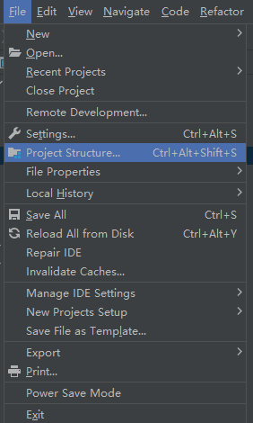
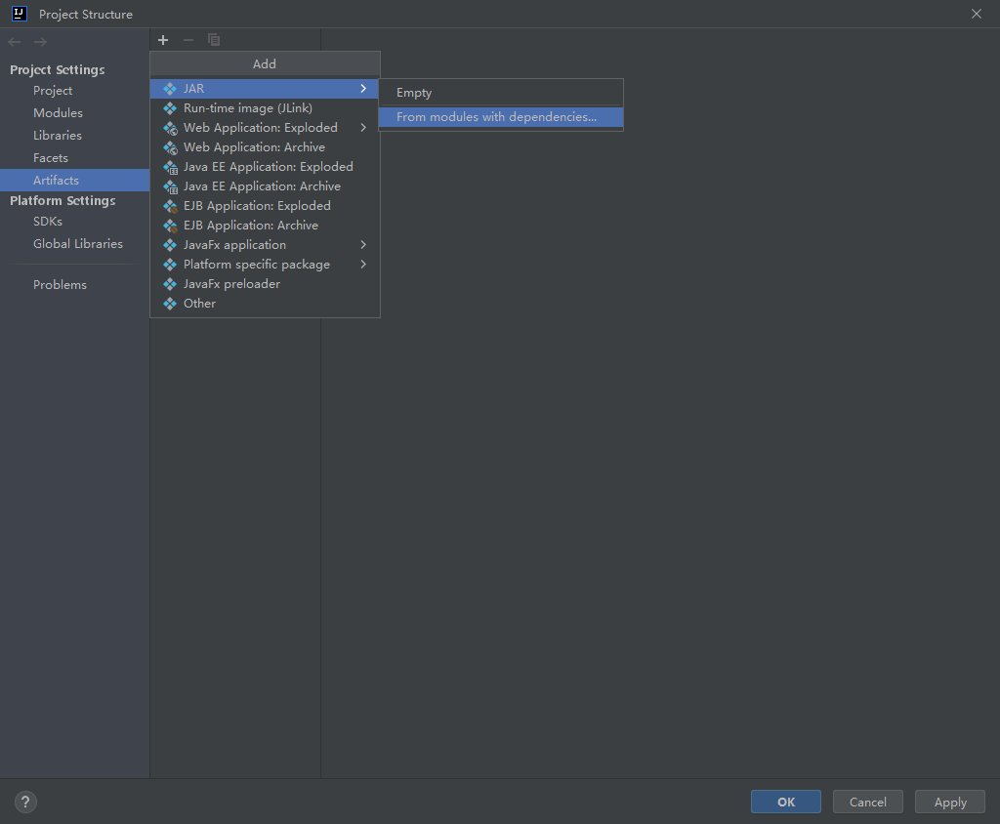
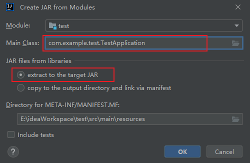
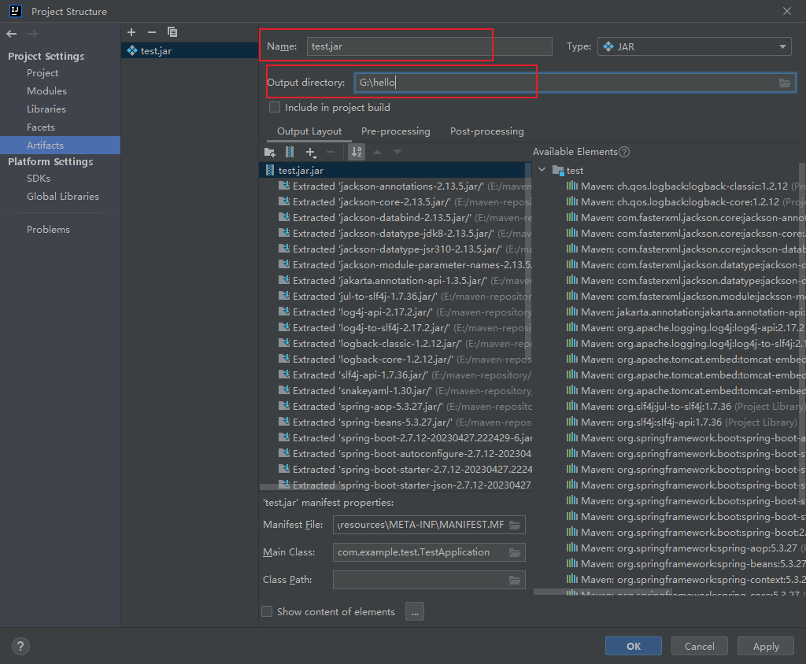
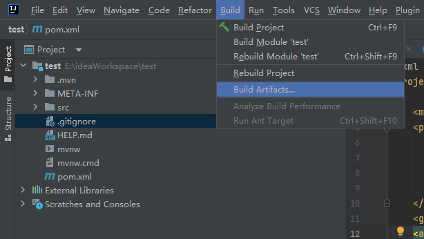
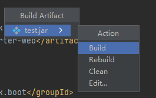
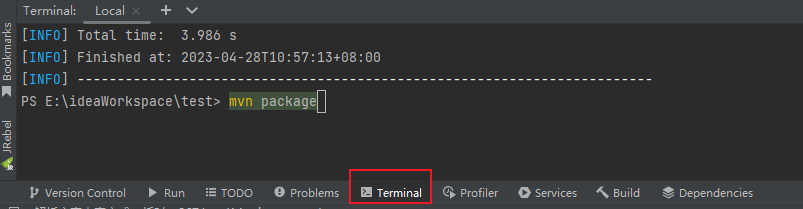
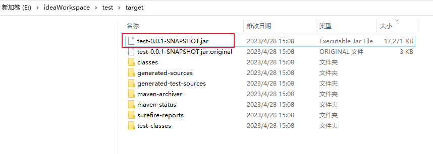

title: IDEA 打包jar
date: 2025-06-17
tags: [idea]

## IDEA 打包jar

*使用版本idea2023.3.1*

**打包jar的两种方式：**

### 一.使用idea打包

#### 1.Project Structure

`File --> Project Structure`

#### 2.添加Artifacts

`Artifacts -->JAR --> From modules`

####  3.选择Main  Class

#### 4.配置jar包name和输出路径

#### 5.build打包

`Build --> Build Artifacts`

可以在输出路径查看`jar`包,选择`clean`可以清除包

### 二.使用maven打包

`maven`项目，可以点击`maven`的`package`打包

也可以命令行打包`mvn package`

生成的`jar`在根目录的`target`目录下

