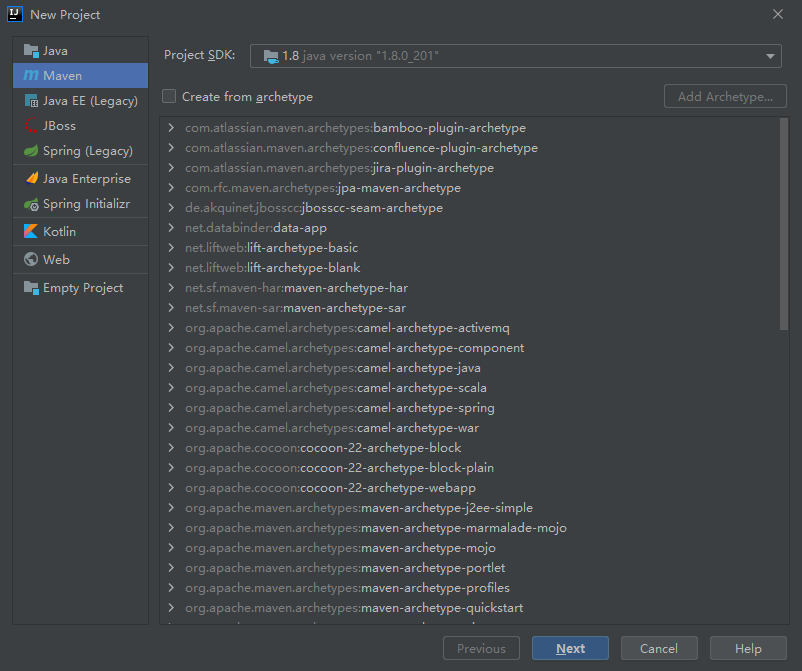
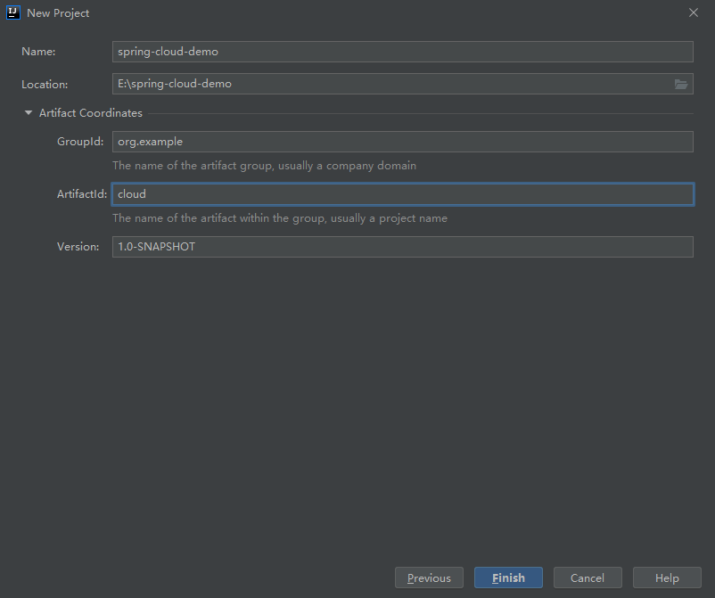
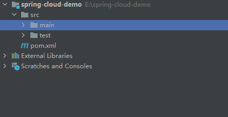
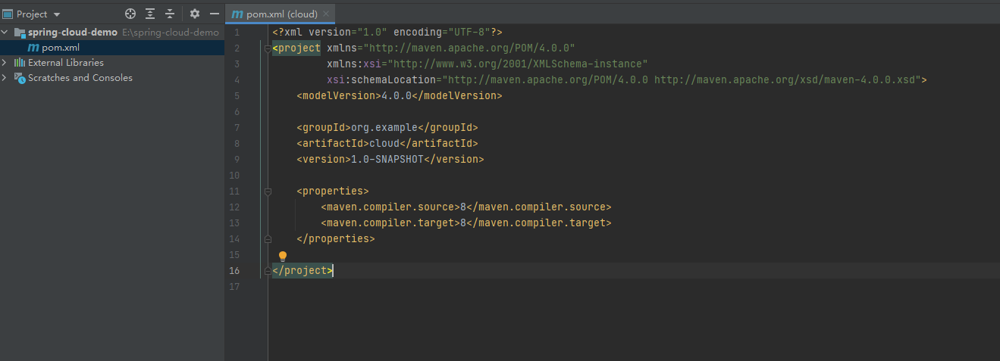
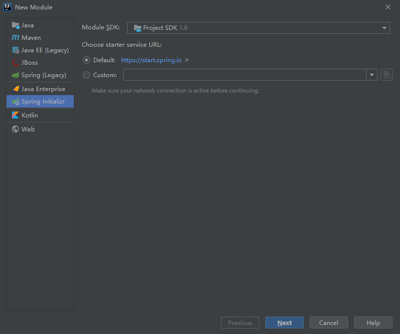
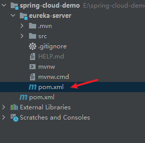
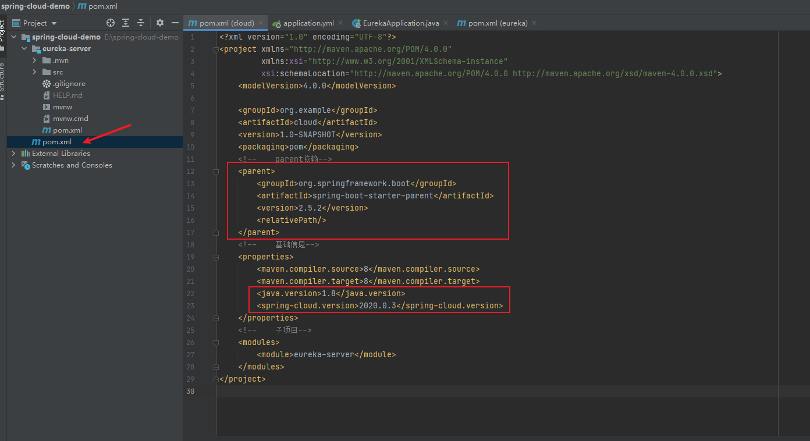

title: IDEA 打包jar
date: 2025-06-17
tags: [idea]

##　IDEA 创建父子项目详解

### 创建父项目

新建maven项目






目录结构如下



删除src ，pom如下



### 创建子项目

创建子项目module，选择`Spring Initializr`。



创建一个eureka-server子项目



eureka-server的pom.xml

```java
<?xml version="1.0" encoding="UTF-8"?>
<project xmlns="http://maven.apache.org/POM/4.0.0" xmlns:xsi="http://www.w3.org/2001/XMLSchema-instance"
         xsi:schemaLocation="http://maven.apache.org/POM/4.0.0 https://maven.apache.org/xsd/maven-4.0.0.xsd">
    <modelVersion>4.0.0</modelVersion>
    <parent>
        <groupId>org.springframework.boot</groupId>
        <artifactId>spring-boot-starter-parent</artifactId>
        <version>2.5.2</version>
        <relativePath/> <!-- lookup parent from repository -->
    </parent>
    <groupId>com.example</groupId>
    <artifactId>eureka</artifactId>
    <version>0.0.1-SNAPSHOT</version>
    <name>eureka</name>
    <description>Demo project for Eureka</description>
    <properties>
        <java.version>1.8</java.version>
        <spring-cloud.version>2020.0.3</spring-cloud.version>
    </properties>
    <dependencies>
        <dependency>
            <groupId>org.springframework.boot</groupId>
            <artifactId>spring-boot-starter-web</artifactId>
        </dependency>
        <dependency>
            <groupId>org.springframework.cloud</groupId>
            <artifactId>spring-cloud-starter-netflix-eureka-server</artifactId>
        </dependency>

        <dependency>
            <groupId>org.springframework.boot</groupId>
            <artifactId>spring-boot-starter-test</artifactId>
            <scope>test</scope>
        </dependency>
    </dependencies>
    <dependencyManagement>
        <dependencies>
            <dependency>
                <groupId>org.springframework.cloud</groupId>
                <artifactId>spring-cloud-dependencies</artifactId>
                <version>${spring-cloud.version}</version>
                <type>pom</type>
                <scope>import</scope>
            </dependency>
        </dependencies>
    </dependencyManagement>

    <build>
        <plugins>
            <plugin>
                <groupId>org.springframework.boot</groupId>
                <artifactId>spring-boot-maven-plugin</artifactId>
            </plugin>
        </plugins>
    </build>

</project>

```

将子项目生成的如下依赖剪切到父项目pom



父项目添加modules

```yml
<modules>
	<module>eureka-server</module>
</modules>
```

子项目添加父项目标识

```
<parent>
    <groupId>org.example</groupId>
    <artifactId>cloud</artifactId>
    <version>1.0-SNAPSHOT</version>
</parent>
```

搭建成功

添加其他子项目就执行最后两步。

