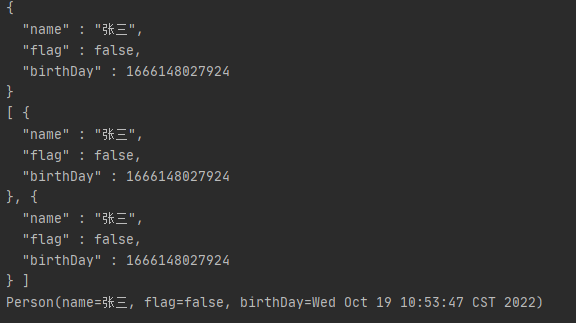

## Jackson基本使用

fastjson问题太多，转向Jackson

springboot默认json是Jackson,引入web依赖自带jackson依赖


### 1.创建一个Person类

```java
import com.fasterxml.jackson.annotation.JsonFormat;
import lombok.Data;

import java.util.Date;

@Data
public class Person {
    private String name;
    //@JsonFormat(pattern = "yyyy-MM-dd")
    private Boolean flag;
    private Date birthDay;
}
```

#### 2测试

```java
@Test
void testJson() throws IOException {
    Person person = new Person();
    person.setBirthDay(new Date());
    person.setName("张三");
    person.setFlag(false);
    //1.对象转json
    ObjectMapper mapper = new ObjectMapper();
    String s = mapper.writerWithDefaultPrettyPrinter().writeValueAsString(person);
    System.out.println(s);
    //2.list转json
    List<Person> personList = new ArrayList<>();
    personList.add(person);
    personList.add(person);
    String str = mapper.writerWithDefaultPrettyPrinter().writeValueAsString(personList);
    System.out.println(str);

    //3.json转对象
    Person person1 = mapper.readValue(s, Person.class);
    System.out.println(person1);
}
```

#### 3.结果



可以看到时间默认序列化时间戳

####　4.注解

- @JsonIgnore：排除属性，即当前注解属性不转化json
- @JsonFormat：属性值的格式化，常用在日期属性上，eg：@JsonFormat(pattern = "yyyy-MM-dd")
- @JsonProperty:  类似于sql里字段的别名，用于序列化，使用注解字段属性，替代原字段属性

```java
@JsonProperty("userName")
private String name;
序列化结果为：在序列化的json串中，userName替代了name
{"userName":"tom"}
```

- @JsonIgnoreProperties：与@JsonIgnore类似，用于类上

  ```java
  @JsonIgnoreProperties({"id","userName","birthday"})
  public class User {
      private Long id;
      @JsonProperty("userName")
      private String name;
      private Integer age;
      private Date birthday;
  }
  
  序列化结果为：
  {"age":23}
  ```

  

