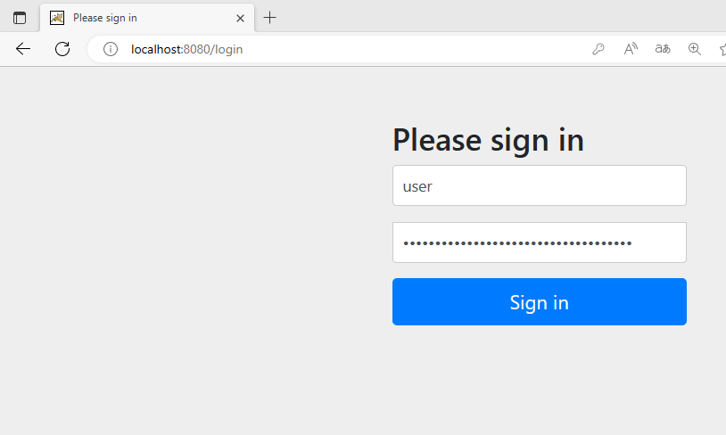

spring security学习

1.核心功能

- 认证
- 授权
- 攻击防护

### 1.引入依赖

```xml
<dependency>
    <groupId>org.springframework.boot</groupId>
    <artifactId>spring-boot-starter-security</artifactId>
</dependency>
```

### 2.新建controller测试

```java
@RestController
public class IndexController {
    @GetMapping("/index")
    public String index() {
        return "Hello World ~";
    }
}
```

不进行任何配置，默认用户名`user`,密码随机生成打印在控制台

默认跳转到`login`页



## springSecurity用户密码配置

1.可以通过`application.yml`配置

```yaml
spring:
  security:
    user:
      name: admin  # 用户名
      password: 123456  # 密码
```

2.代码配置(实际没啥用)

```java
@Configuration
public class SecurityConfig {

    @Bean
    public PasswordEncoder passwordEncoder() {
        return new BCryptPasswordEncoder();
    }

    @Bean
    public InMemoryUserDetailsManager userDetailsService() {
        UserDetails user = User.builder()
                .username("user")
                .password(passwordEncoder().encode("111"))
                .roles("admin")
                .build();
        return new InMemoryUserDetailsManager(user);
    }
}
```

3.**自定义实现类完成用户登录**

实际项目账号密码都是查询，所以我们要自定义逻辑，只需要实现`UserDetailsService`

这里我没有连接数据库查询

```java
@Service
public class MyUserDetailsServiceImpl implements UserDetailsService {

    @Override
    public UserDetails loadUserByUsername(String username) throws UsernameNotFoundException {
        //使用username查询数据库
        User user = new User();
        user.setName("user");
        user.setPassword(new BCryptPasswordEncoder().encode("123"));

        //数据库没有数据，认证失败
        if (user == null) {
            throw new UsernameNotFoundException("用户不存在！");
        }
        //配置角色, 可以从数据库获取
        List<GrantedAuthority> auths = AuthorityUtils.commaSeparatedStringToAuthorityList("role");

        return new org.springframework.security.core.userdetails.User(user.getName(), user.getPassword(), auths);
    }

}
```

配置加密方式

```java
@Configuration
public class PasswordEncoderConfig {

    @Bean
    public PasswordEncoder passwordEncoder() {
        return new BCryptPasswordEncoder();

    }
}
```

现在就可以直接使用了

https://blog.csdn.net/weixin_44496396/article/details/122867665

### 登录处理和拦截

security默认有登录页和登出页，xxx/login,xxx/logout


springboot2.7后，WebSecurityConfigurerAdapter已经过时了

https://www.imooc.com/article/325964

https://blog.csdn.net/qq_53422478/article/details/126924381

1.配置无需登录的页面


