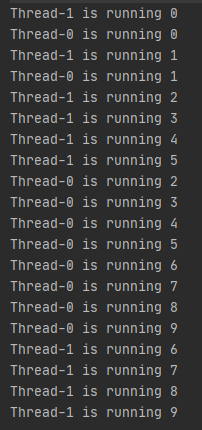
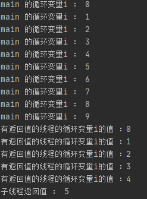
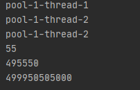

创建线程的三种方式

一、继承Thread类创建

通过`继承``Thread`并且重写其run()，run方法中即线程执行任务。创建后的子类通过调用 start() 方法即可执行线程方法。

通过继承Thread实现的线程类，多个线程间无法共享线程类的实例变量。（需要创建不同Thread对象，自然不共享）

```java
public class ThreadTest extends Thread {
    private int i = 0;

    @Override
    public void run() {
        for (; i < 10; i++) {
            System.out.println(Thread.currentThread().getName() + " is running " + i);
        }
    }

    public static void main(String[] args) {
        new ThreadTest().start();
        new ThreadTest().start();
    }
}
```



结果：可以看到的两个thread分别执行了10次。

二、 通过Runnable接口创建线程类

该方法需要先 定义一个类实现Runnable接口，并重写该接口的 run() 方法，此run方法是线程执行体。

接着创建 Runnable实现类的对象，作为创建Thread对象的参数target，此Thread对象才是真正的线程对象。通过实现Runnable接口的线程类，是互相共享资源的。

```java
/**
 * 通过实现Runnable接口实现的线程类
 */
public class RunnableTest implements Runnable {
    private int i = 10;

    @Override
    public void run() {
        while (true) {
            System.out.println(Thread.currentThread().getName() + " -- " + (i--));
            if (i < 1) {
                break;
            }
        }
    }

    public static void main(String[] args) {

        RunnableTest runnableTest = new RunnableTest();
        new Thread(runnableTest, "线程1").start();
        new Thread(runnableTest, "线程2").start();

    }

}
```


结果：线程1和线程2总共执行10次

说明是共享资源

三、 使用Callable和Future创建线程

从继承Thread类和实现Runnable接口可以看出，上述两种方法都不能有返回值，且不能声明抛出异常。而Callable接口则实现了此两点，Callable接口如同Runable接口的升级版，其提供的call()方法将作为线程的执行体，同时允许有返回值，Future用来获取结果。


```java
public class CallableTest {
    public static void main(String[] args) {
        //CallableTest callableTest = new CallableTest() ;
        //因为Callable接口是函数式接口，可以使用Lambda表达式
        FutureTask task = new FutureTask((Callable) () -> {
            int i = 0;
            for (; i < 5; i++) {
                System.out.println(Thread.currentThread().getName() + "的循环变量i的值 ：" + i);
            }
            return i;
        });
        for (int i = 0; i < 10; i++) {
            System.out.println(Thread.currentThread().getName() + " 的循环变量i ： " + i);
            if (i == 5) {
                new Thread(task, "有返回值的线程").start();
            }
        }
        try {
            System.out.println("子线程返回值 ： " + task.get());
        } catch (Exception e) {
            e.printStackTrace();
        }
    }
}
```



结果：有返回值

四，有传参的Callable

```java
public class Sums {
    // Callable，有返回值
    static class Sum implements Callable<Long> {
        // 传入参数： from 和 to
        private final long from;
        private final long to;

        // 从带参的构造器这里获得传入的参数：from 和 to
        Sum(long from, long to) {
            this.from = from;
            this.to = to;
        }

        // 返回Long类型的自加结果
        @Override
        public Long call() {
            long acc = 0;
            // 从0开始的自加循环，从from计数到to
            for (long i = from; i <= to; i++) {
                acc = acc + i;
            }
            System.out.println(Thread.currentThread().getName());
            return acc;
        }
    }

    public static void main(String[] args) throws Exception {

        ExecutorService executor = Executors.newFixedThreadPool(2);
        List<Future<Long>> results = executor.invokeAll(asList(
                new Sum(0, 10), new Sum(100, 1_000), new Sum(10_000, 1_000_000)
        ));
        executor.shutdown();

        for (Future<Long> result : results) {
            System.out.println(result.get());
        }
    }
}
```



结果：传入参数并返回结果

