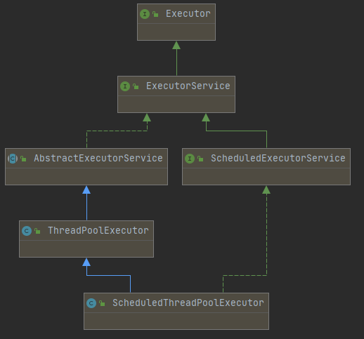
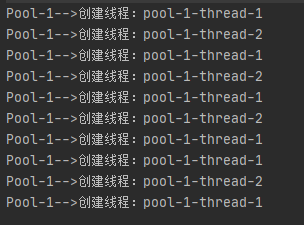
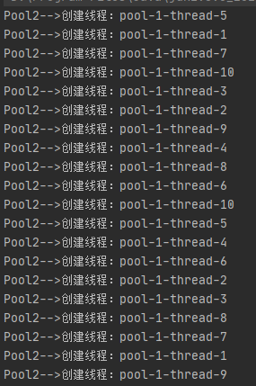
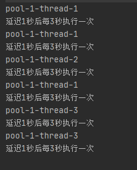

## 线程池创建



*线程池架构如图，顶级接口是Executor,线程池接口是ExecutorService，ThreadPoolExecutor是默认实现。*

###　1.Executors.newCachedThreadPool

可缓存线程池，先查看线程池中有没有之前创建的线程，如果有则直接使用。否则就新创建一个新的线程加入线程池中

```java
        //创建一个可缓存的线程池
        ExecutorService executorService1 = Executors.newCachedThreadPool();
        for (int i = 0; i < 10; i++) {
            try {
                //模拟线程调用间隔时间
                Thread.sleep(100);
            } catch (InterruptedException e) {
                e.printStackTrace();
            }
            executorService1.submit(() -> {
                try {
                    //模拟业务处理时间
                    Thread.sleep(100);
                } catch (InterruptedException e) {
                    e.printStackTrace();
                }
                System.out.println("Pool-1-->创建线程：" + Thread.currentThread().getName());
            });
        }
```



### 2.Executors.newFixedThreadPool()

创建一个固定（指定）长度可重用的线程池，可以控制最大创建数，超过最大长度之后就会放入到队列进行等待。

```java
        //固定（指定）长度可重用的线程池
        ExecutorService executorService = Executors.newFixedThreadPool(10);
        for (int i = 0; i < 20; i++) {
            executorService.submit(() -> {
                try {
                    //模拟业务处理时间
                    Thread.sleep(1000);

                } catch (InterruptedException e) {
                    e.printStackTrace();
                }
                System.out.println("Pool2-->创建线程：" + Thread.currentThread().getName());
            });
        }
```



### 3.Executors.newSingleThreadExecutor

创建一个单线程化的线程池，它只会用唯一的工作线程来执行任务，保证所有任务按照指定顺序(FIFO, LIFO, 优先级)执行。

```java
        ExecutorService executorService3 = Executors.newSingleThreadExecutor();
        for (int i = 0; i < 10; i++) {
            executorService3.submit(() -> {
                try {
                    //模拟业务处理时间
                    Thread.sleep(1000);

                } catch (InterruptedException e) {
                    e.printStackTrace();
                }
                System.out.println("Pool3-->创建线程：" + Thread.currentThread().getName());
            });
        }
```


### 4.Executors.newScheduledThreadPool

创建一个定长线程池，支持定时及周期性任务执行

```java
        ScheduledExecutorService scheduledExecutorService = Executors.newScheduledThreadPool(5);
        scheduledExecutorService.scheduleAtFixedRate(new Runnable() {
            @Override
            public void run() {
                System.out.println(Thread.currentThread().getName());
                System.out.println("延迟1秒后每3秒执行一次");
            }
        }, 1, 3, TimeUnit.SECONDS);

```




### Executors和ThreaPoolExecutor创建线程池的区别

**Executors** 

1.newFixedThreadPool 和 newSingleThreadExecutor:
主要问题是堆积的请求处理队列可能会耗费非常大的内存，甚至 OOM。
2.newCachedThreadPool 和 newScheduledThreadPool:
主要问题是线程数最大数是` Integer.MAX_VALUE`，可能会创建数量非常多的线程，甚至 OOM。

**ThreaPoolExecutor**

创建线程池方式只有一种，就是走它的构造函数，参数自己指定

###　两种提交任务的方法

ExecutorService 提供了两种提交任务的方法：

- execute()：提交不需要返回值的任务
- submit()：提交需要返回值的任务

**execute**

execute() 的参数是一个 Runnable，也没有返回值。因此提交后无法判断该任务是否被线程池执行成功。

```java
ExecutorService executor = Executors.newCachedThreadPool();
executor.execute(new Runnable() {
    @Override
    public void run() {
        //do something
    }
});
```

**submit**

```java
        public Future<?> submit(Runnable task) {
            return e.submit(task);
        }
        public <T> Future<T> submit(Callable<T> task) {
            return e.submit(task);
        }
        public <T> Future<T> submit(Runnable task, T result) {
            return e.submit(task, result);
        }
```

参数可以是Callable或Runnable,返回一个Funture对象， Future.get() 方法可以获取返回值。

- submit(Runnable task)方法参数是Runnable接口，实现Runnable的线程是没有返回值的，所以这个submit虽然能够返回Future对象，调用其get方法还是返回null值的。
- submit(Callable task)方法参数是Callable接口（线程如果实现Callable接口，那么要求实现call()方法，这个方法支持返回值），显然实现Callable的线程是能够返回值的，所以这个submit能够返回Future对象，同时调用get方法还能得到返回值。
- submit(Runnable task, T result);和第一种提交方式相比多了result对象，这个对象其实就是后面Future.get出来的返回值。

