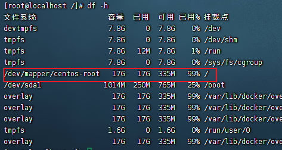
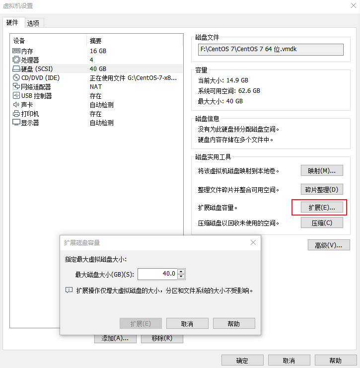
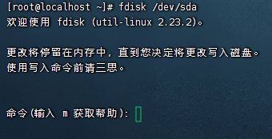
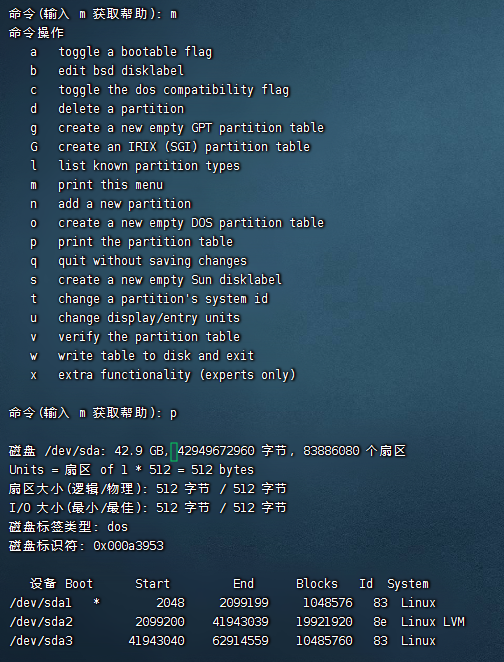
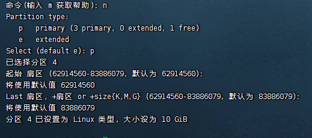
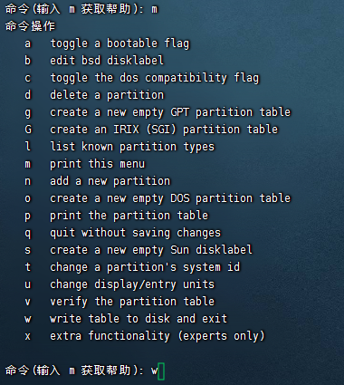
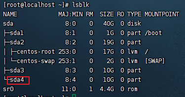
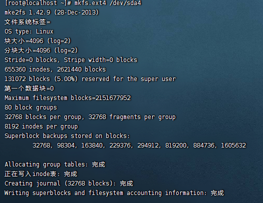
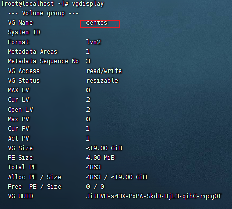
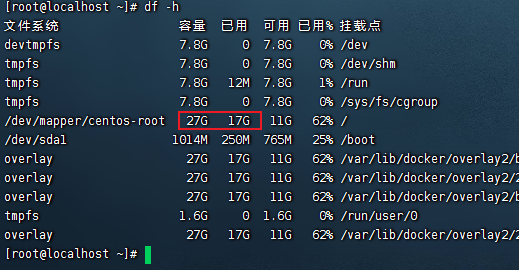

## /dev/mapper/centos-root 扩容

出现问题空间不足




解决方法：扩容

1.虚拟机设置扩展磁盘



2.分区

`fdisk /dev/sda`



输入`m`,`p`,查看当前分区



输入`n`新建分区，输入p建立分区，然后回车



最后输入w，保存退出



建立好的分区还不能用，还需要挂载才可以用。但是挂载之前，必须要格式化。


3.格式化

reboot重启虚拟机 或`partprobe`刷新

`lsblk`查看分区,sda4就是新建的分区



格式化`mkfs.ext4 /dev/sda4`



4.物理分区转为卷组

`pvcreate /dev/sda4`

5.显示卷组

`vgdisplay`



6扩容/dev/sda4分区到centos卷组

```bash
vgextend centos /dev/sda4
```

7将扩展空间扩容到/dev/mapper/centos-root

```bash
lvextend -l +100%FREE /dev/mapper/centos-root
```

8更新逻辑卷，使扩容生效

xfs文件系统使用此命令：

```bash
xfs_growfs /dev/mapper/centos-data
```

ext4文件系统使用此命令：

```bash
resize2fs /dev/mapper/centos-data
```

9查看磁盘目录

```bash
df -h
```



成功挂载