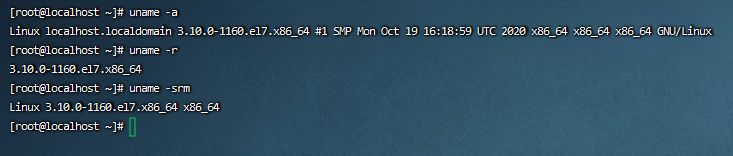
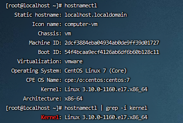
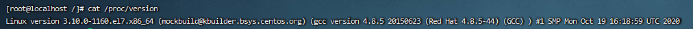

title: linux 查看内核版本
date: 2025-06-17
tags: [linux]

##　linux 查看内核版本

### 1.`uname`命令

```shell
uname -a
uname -r
uname -srm
```



```shell
Linux 3.10.0-1160.el7.x86_64 x86_64
3 - 内核版本
10 - 主修订版本
0-1160 - 次修订版本
```

### 2.`hostnamectl`命令

```shell
hostnamectl
hostnamectl | grep -i kernel
```



### 3.查看`/proc/verison` 

```sh
cat /proc/version
```



