minio管理页面

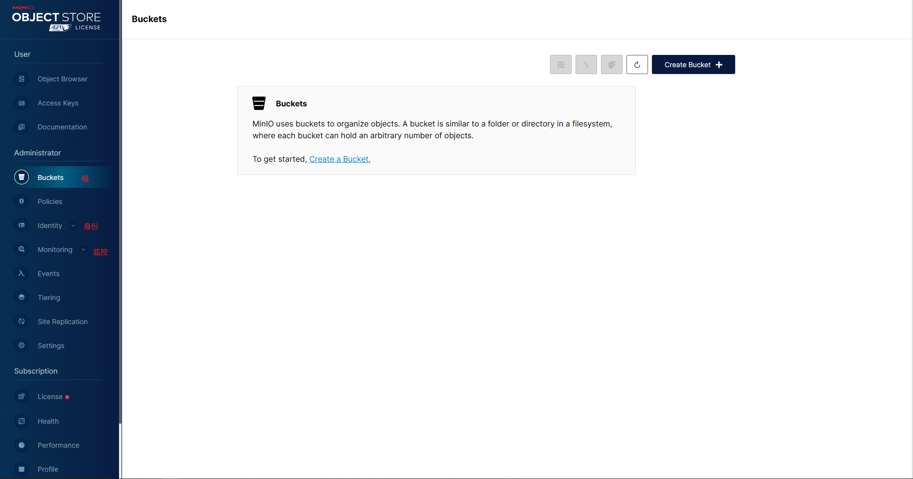

###　Buckets(桶)

桶类似与文件夹的概念。

1. create Buchket

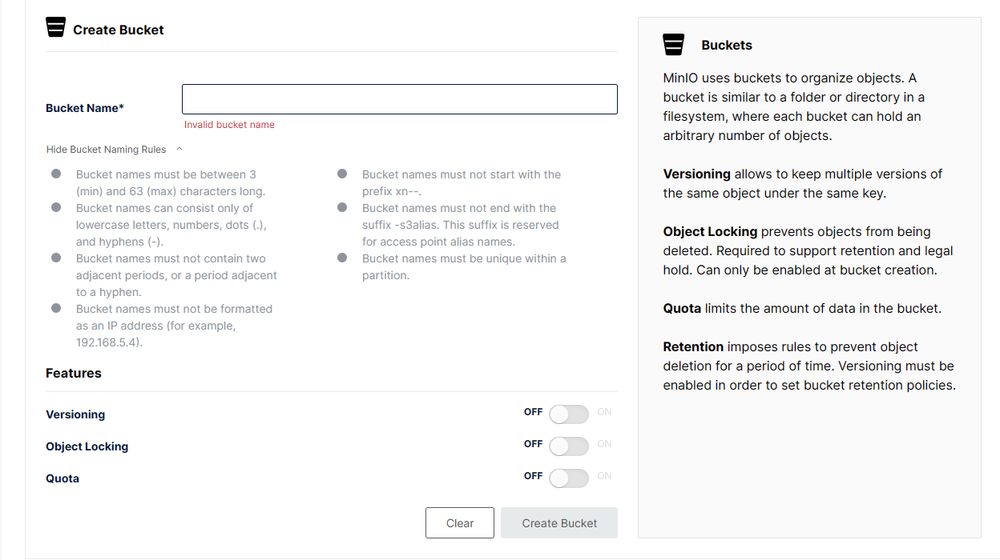

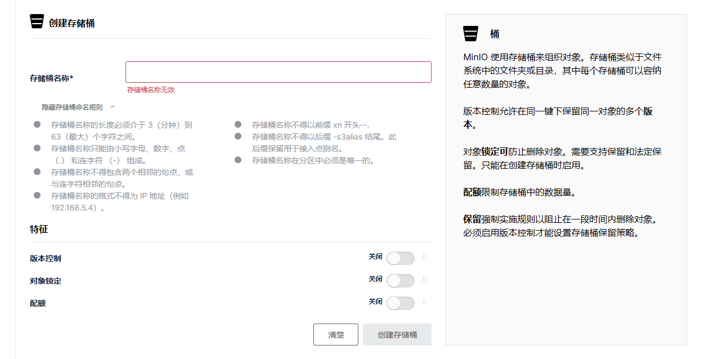

- Versioning:默认情况下，对唯一对象名称的每次新写入操作都会导致覆盖该对象,开启versioning可以保留版本不会覆写

- Object Locking:对象锁定，防止删除对象

- Quota :配置桶容量

  

  2.文件操作

  上传：点击桶，点击`upload`，可以上传文件和文件夹

  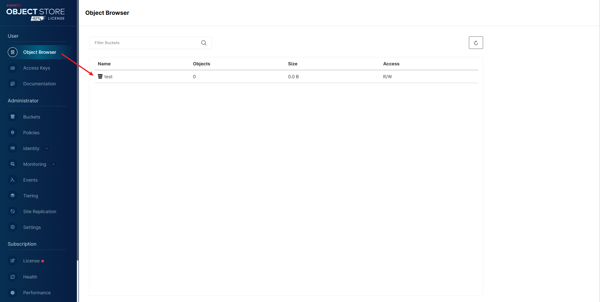

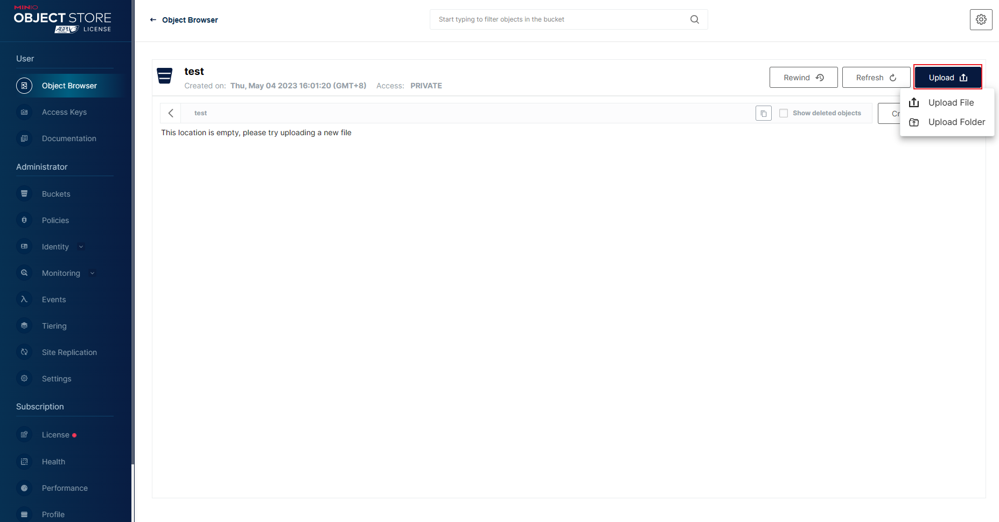

点击上传的文件，右侧查看文件其他操作

- Download: 下载
- Share: 链接分享
- Preview:预览
- Display Object Versions:查看所有版本
- Delete:删除

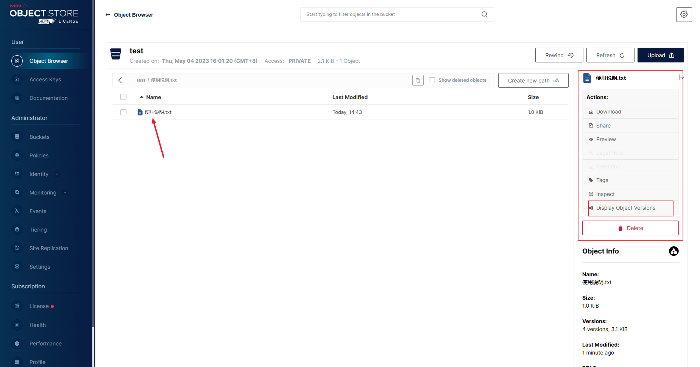

###　Bucket相关的配置

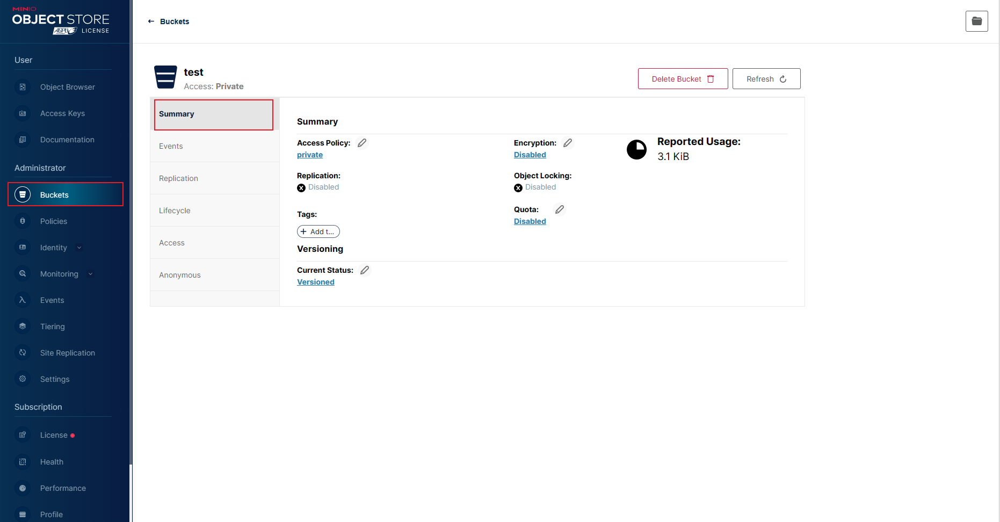

Summary(概要)：

- Access Policy：有三个值，private，public，custom。私有代表需要通过验签且生成的url只有7天有效期。公共代表不需要验签通过永久可以访问。自定义就是可以自己定义那些前缀是只读，那些前缀是读写的等。
- Encyption：有三个值，Disabled,SSE-S3,SSE-KMS。加密类型。

Events:事件，主要是给这个Bucket绑定那些事件通知。

Replication:略。

Lifecycle：配置这个bucket的生命周期。Expiry指过期删除，Transition指过期转移到目标服务器，需搭配Tiering使用。After表示多少天过期，Prefix指文件名前缀。

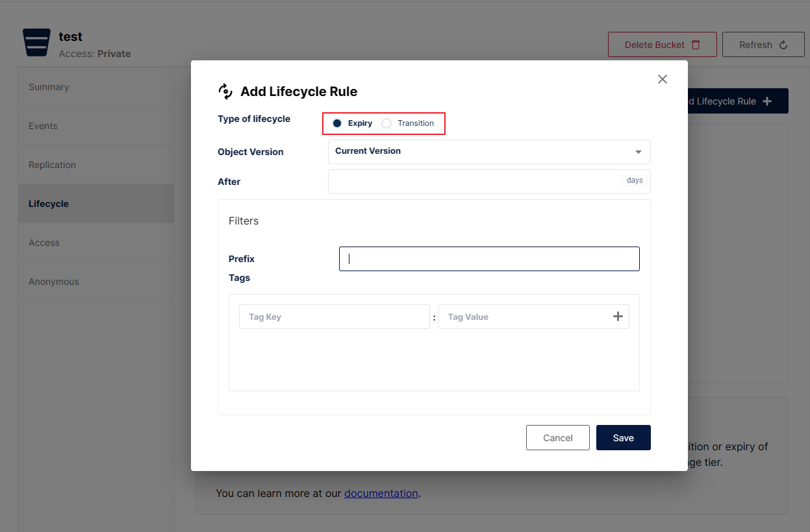

Access:访问权限，略。

Anonymous:配置Access Poilcy为custom，可以自己定义前缀的读写。

### Policies (策略)

MinIO使用基于策略的访问控制(PBAC)来定义经过身份验证的用户有权访问的授权操作和资源。

自带的只读只写等策略已足够使用。

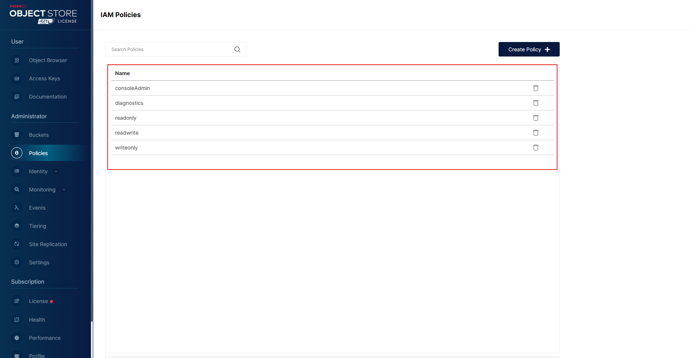

###  Identity(身份)

这里用网页翻译了一下

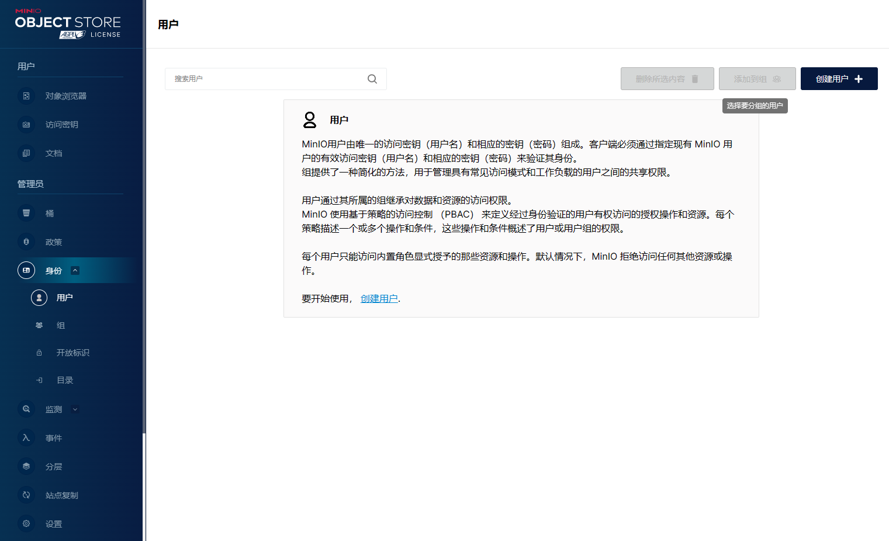

Users:

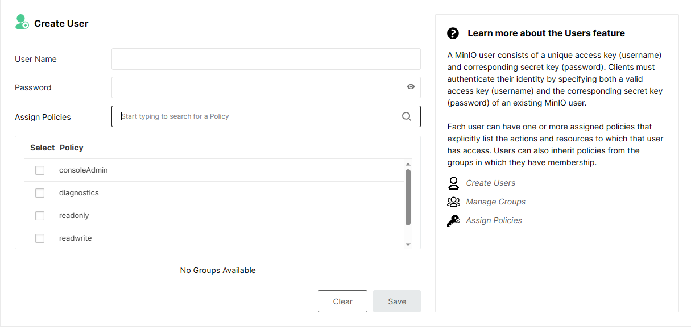

`create user`,用户名密码和选择策略，策略可以勾选多个，策略即权限。

Group:

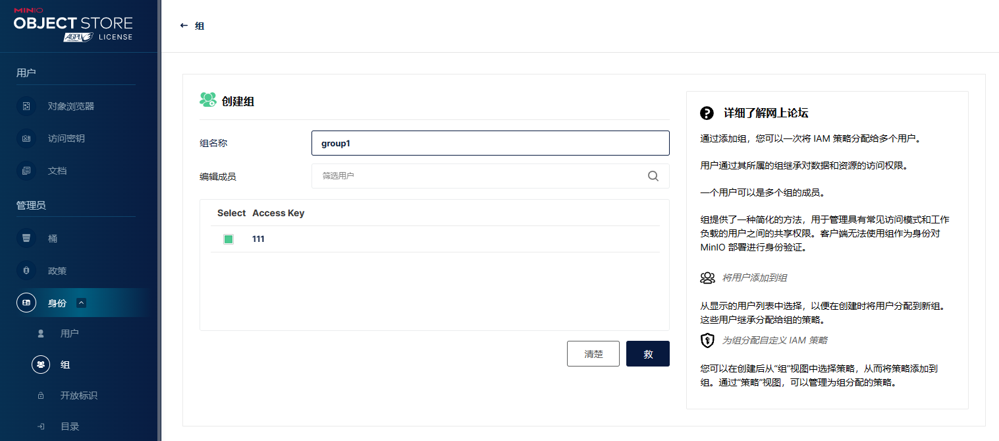

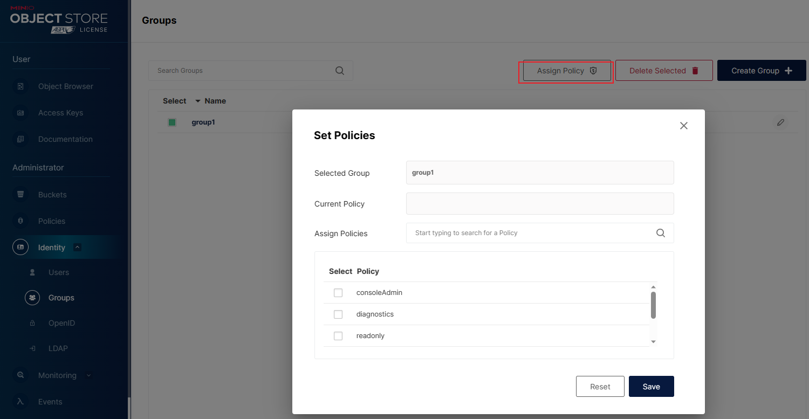

创建用户组，添加用户。

创建完组后，选择组添加策略。一个用户可以放在多个组里，继承组的权限。

#### OpenId

官方解释：MinlO支持使用OpenID Connect (OIDC)兼容的身份提供者(IDP)，如Okta, KeyCloak, Dex，谷歌或Facebook进行用户身份的外部管理。配置外部IDP可启用单点登录工作流，其中应用程序在访问MinIO之前根据外部IDP进行身份验证。大概就是可以通过OpenId来实现单点登录，以及外部的验权，配合目前流行的权限框架实现此功能。
略。

#### LDAP

官方解释：创建配置MinlO支持使用Active Directory或LDAP (AD/LDAP)服务进行用户身份的外部管理。配置外部身份提供程序(IDP)启用单点登录(SSO)工作流，其中应用程序之前根据外部IDP进行身份验证accessing Minlo。MinIO查询配置的Active Directory / LDAP服务器，以验证应用程序指定的凭据，并可选地返回用户所属的组列表。MinIO支持两种模式(查找绑定模式和用户名绑定模式)来执行这些查询MinlO建议使用Lookup-Bind模式作为验证AD/LDAP凭据的首选方法。用户名绑定模式是仅为向后兼容而保留的传统方法。
略。

### Monitoring（监控）

#### Metrics（指标）

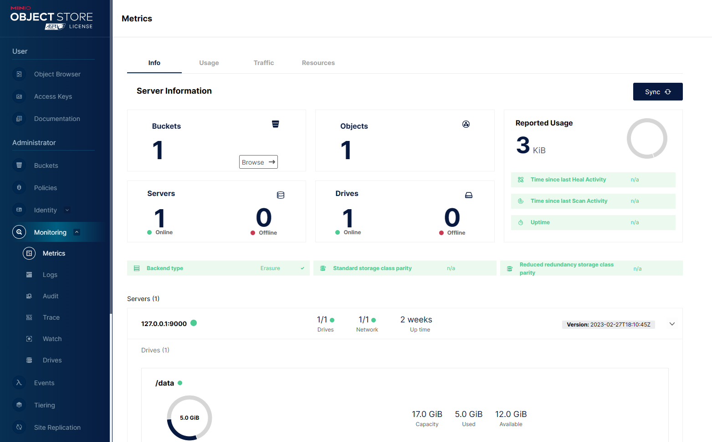

MinIO 支持 [Prometheus](https://prometheus.io/) 用于指标和警报。 Prometheus 是一个开源系统和服务监控系统 支持基于收集的指标进行分析和警报。 Prometheus 生态系统包括多个 [integrations](https://prometheus.io/docs/operating/integrations/), 允许广泛的处理和存储范围 收集的指标。

MinIO 使用 Prometheus 兼容数据发布收集的指标数据 结构。 任何与 Prometheus 兼容的抓取软件都可以摄取和 处理 MinIO 指标以进行分析、可视化和警报。可以与Prometheus集成显示监控大屏。

其余略。

### Events(事件通知)

MinIO 存储通知允许管理员将通知发送到 支持特定对象或存储桶事件的外部服务。

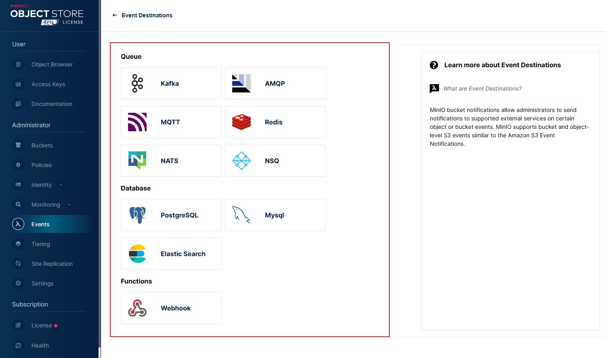

我们用mysql试一下，填写连接配置和表名，然后点下面`Save Event Destination`

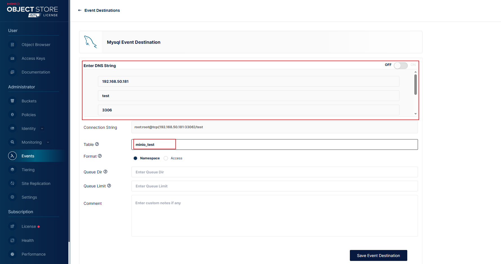

点击`Restart`

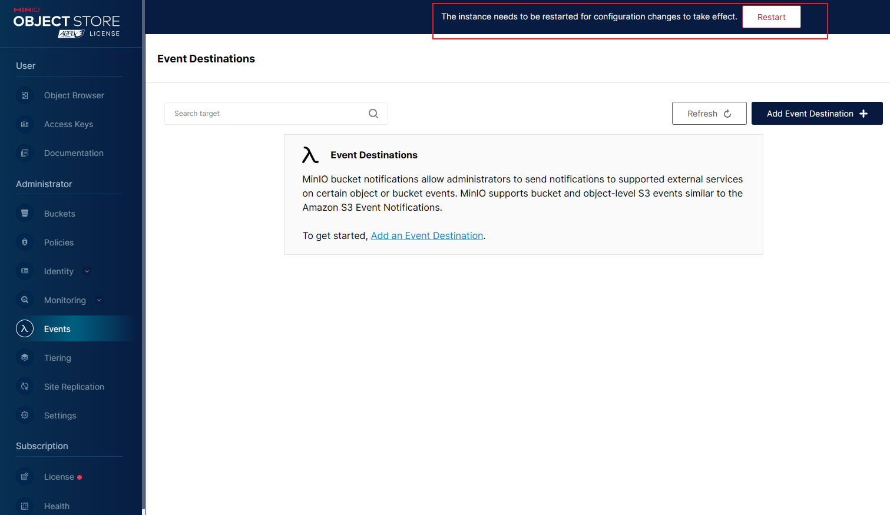

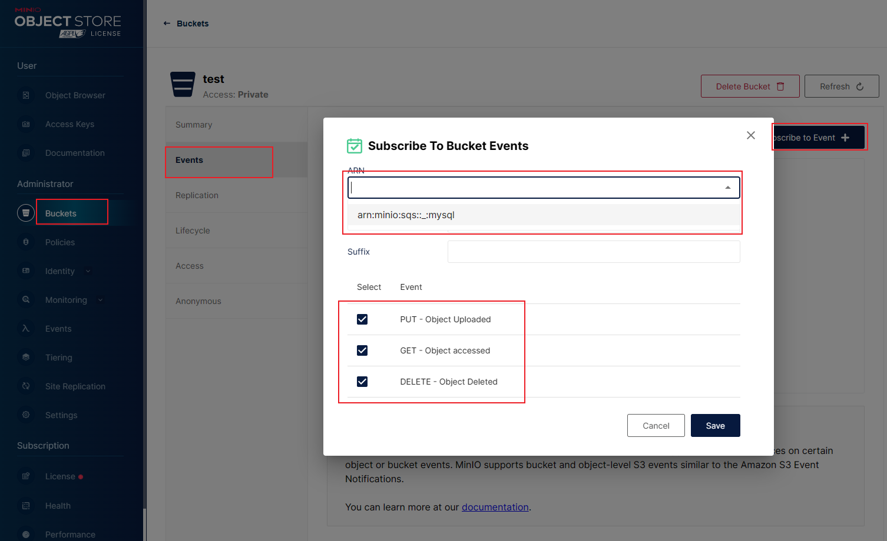

在Buckets的Events里添加连接和需要的PUT等事件。

上传文件后在mysql查看

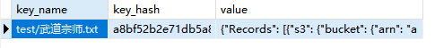

### Tiering（对象生命周期管理）

对象生命周期可以用户自定义管理，但是对象过期了怎么办Minio提供了两种选择，要么直接删除该对象，要么把该对象转换到远端的存储服务上去。

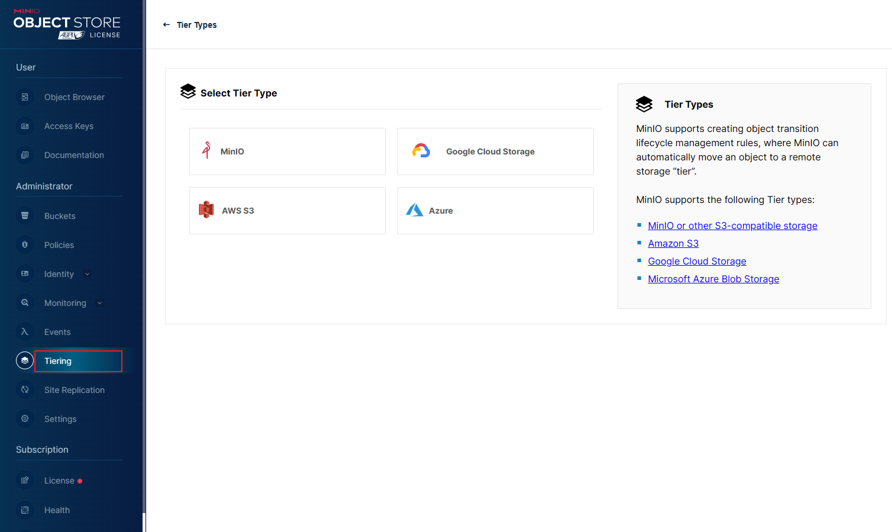

### Site Replication（复制站点）

网站复制，该特性允许将多个使用相同外部身份提供程序(IDP)的独立MinlO站点(或集群)配置为副本。

就是可以复制一个副本出来，到目标网站，方便搭建集群，以及迁移什么的，无需再繁琐的配置等等。

需要填写本站和目标站，目标站可以多个。

