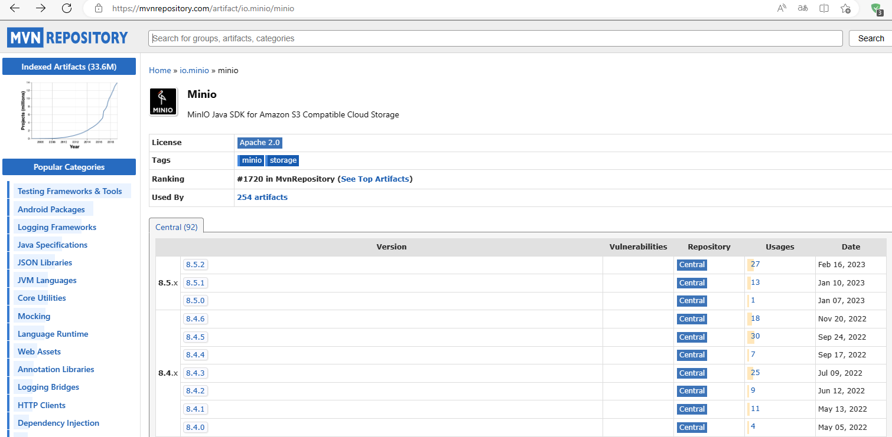

## Springboot+minio

**基础功能：文件的上传下载，分享外链，查看桶赫尔文件列表，文件信息等。**

### 1.引入依赖

https://mvnrepository.com/



加入`maven`项目`pom.xml`

```xml
<dependency>
    <groupId>io.minio</groupId>
    <artifactId>minio</artifactId>
    <version>8.5.2</version>
</dependency>
```

### 2.yml配置

```yaml
minio:
  endpoint: http://xxx:9090/
  bucketName: test
  accessKey: xxx
  secretKey: xxx
```

### 3.添加配置类

```java
package com.smallmayi.bootminio.config;

import io.minio.MinioClient;
import lombok.Data;
import org.springframework.boot.context.properties.ConfigurationProperties;
import org.springframework.context.annotation.Bean;
import org.springframework.context.annotation.Configuration;

/**
 * @author smallmayi
 */
@Data
@Configuration
@ConfigurationProperties(prefix = "minio")
public class MinConfig {
    private String url;
    private String accessKey;
    private String secretKey;
    private String bucketName;

    @Bean
    public MinioClient minioConfig() {
        return MinioClient.builder()
                .endpoint(url)
                .credentials(accessKey, secretKey)
                .build();
    }
}
```

### 4.MinioUtil

```java
package com.smallmayi.bootminio.util;

import com.smallmayi.bootminio.domain.Fileinfo;
import io.minio.*;
import io.minio.http.Method;
import io.minio.messages.Bucket;
import io.minio.messages.Item;
import org.springframework.beans.factory.annotation.Autowired;
import org.springframework.stereotype.Component;

import java.io.InputStream;
import java.util.ArrayList;
import java.util.List;

/**
 * @author smallmayi
 */
@Component
public class MinioUtil {
    private static MinioClient minioClient;

    @Autowired
    public MinioUtil(MinioClient minioClient) {
        MinioUtil.minioClient = minioClient;
    }

    /**
     * 创建一个桶
     */
    public static void createBucket(String bucket) throws Exception {
        boolean found = minioClient.bucketExists(BucketExistsArgs.builder().bucket(bucket).build());
        if (!found) {
            minioClient.makeBucket(MakeBucketArgs.builder().bucket(bucket).build());
        }
    }

    /**
     * 上传一个文件
     */
    public static void uploadFile(InputStream stream, String bucket, String objectName) throws Exception {
        minioClient.putObject(PutObjectArgs.builder().bucket(bucket).object(objectName)
                .stream(stream, -1, 10485760).build());
    }

    /**
     * 列出所有的桶
     */
    public static List<String> listBuckets() throws Exception {
        List<Bucket> list = minioClient.listBuckets();
        List<String> names = new ArrayList<>();
        list.forEach(b -> {
            names.add(b.name());
        });
        return names;
    }

    /**
     * 列出一个桶中的所有文件和目录
     */
    public static List<Fileinfo> listFiles(String bucket) throws Exception {
        Iterable<Result<Item>> results = minioClient.listObjects(
                ListObjectsArgs.builder().bucket(bucket).recursive(true).build());

        List<Fileinfo> infos = new ArrayList<>();
        results.forEach(r -> {
            Fileinfo info = new Fileinfo();
            try {
                Item item = r.get();
                info.setFilename(item.objectName());
                info.setDirectory(item.isDir());
                infos.add(info);
            } catch (Exception e) {
                e.printStackTrace();
            }
        });
        return infos;
    }

    /**
     * 下载一个文件
     */
    public static InputStream download(String bucket, String objectName) throws Exception {
        InputStream stream = minioClient.getObject(
                GetObjectArgs.builder().bucket(bucket).object(objectName).build());
        return stream;
    }

    /**
     * 删除一个桶
     */
    public static void deleteBucket(String bucket) throws Exception {
        minioClient.removeBucket(RemoveBucketArgs.builder().bucket(bucket).build());
    }

    /**
     * 删除一个对象
     */
    public static void deleteObject(String bucket, String objectName) throws Exception {
        minioClient.removeObject(RemoveObjectArgs.builder().bucket(bucket).object(objectName).build());
    }


    /**
     * 复制文件
     *
     * @Param: [sourceBucket, sourceObject, targetBucket, targetObject]
     * @return
     */
    public static void copyObject(String sourceBucket, String sourceObject, String targetBucket, String targetObject) throws Exception {
        createBucket(targetBucket);
        minioClient.copyObject(CopyObjectArgs.builder().bucket(targetBucket).object(targetObject)
                .source(CopySource.builder().bucket(sourceBucket).object(sourceObject).build()).build());
    }

    /**
     * 获取文件信息
     *
     * @Param [bucket, objectName]
     * @return
     */
    public static String getObjectInfo(String bucket, String objectName) throws Exception {

        return minioClient.statObject(StatObjectArgs.builder().bucket(bucket).object(objectName).build()).toString();

    }

    /**
     * 生成一个给HTTP GET请求用的presigned URL。浏览器/移动端的客户端可以用这个URL进行下载，即使其所在的存储桶是私有的。
     *
     * @Param [bucketName, objectName, expires] expires 失效时间（以秒为单位），默认是7天，不得大于七天
     * @return String
     */
    public static String getPresignedObjectUrl(String bucketName, String objectName, Integer expires) throws Exception {
        GetPresignedObjectUrlArgs build = GetPresignedObjectUrlArgs
                .builder().bucket(bucketName).object(objectName).expiry(expires).method(Method.GET).build();
        return minioClient.getPresignedObjectUrl(build);
    }

    /**
     * 获取minio中所有的文件
     *
     * @Param: []
     * @return: java.util.List<boot.spring.domain.Fileinfo>
     */
    public static List<Fileinfo> listAllFile() throws Exception {
        List<String> list = listBuckets();
        List<Fileinfo> fileInfos = new ArrayList<>();
        for (String bucketName : list) {
            fileInfos.addAll(listFiles(bucketName));
        }

        return fileInfos;
    }

}
```

### 5.domain

```java
package com.smallmayi.bootminio.domain;

import lombok.Data;

/**
 * @author smallmayi
 */
@Data
public class Fileinfo {
    String filename;

    Boolean directory;

}
```


###  6.controller

```java
package com.smallmayi.bootminio.controller;

import com.smallmayi.bootminio.domain.Fileinfo;
import com.smallmayi.bootminio.service.FileService;
import org.springframework.beans.factory.annotation.Autowired;
import org.springframework.web.bind.annotation.*;
import org.springframework.web.multipart.MultipartFile;

import javax.servlet.http.HttpServletResponse;
import java.util.List;

/**
 * @author smallmayi
 *
 * minio文件基础操作
 */
@RestController
@RequestMapping("/file")
public class FileController {
    @Autowired
    private FileService fileService;

    /**
     * 文件上传
     *
     * @param multipartFile 文件
     * @return 文件地址
     */
    @PostMapping("/upload")
    public String fileUpload(@RequestParam(name = "file") MultipartFile multipartFile) {
        String fileUrl = fileService.fileUpload(multipartFile);
        return fileUrl;
    }

    /**
     * 文件下载
     *
     * @param fileName 文件
     */
    @GetMapping("/down")
    public void fileDown(@RequestParam("fileName") String fileName, HttpServletResponse response) {
        fileService.fileDown(fileName, response);
    }

    /**
     * 文件信息
     *
     * @param fileName 文件
     */
    @GetMapping("/info")
    public String fileDown(@RequestParam("fileName") String fileName) {
        String fileInfo = fileService.fileInfo(fileName);
        //返回值如下，桶名，文件名，时间，字节数，可以自己封装
        // ObjectStat{bucket=test, object=xxx.docx, last-modified=2023-05-15T03:03:39Z, size=78326}
        return fileInfo;
    }


    /**
     * 文件删除
     *
     * @param fileName 文件
     */
    @GetMapping("/delete")
    public String delete(String fileName) {
        fileService.delete(fileName);
        return "删除成功";
    }

    /**
     * 查询一个桶所有文件
     *
     * @return 文件列表
     */
    @GetMapping("/list")
    public List<Fileinfo> fileList() {
        List<Fileinfo> fileInfos = fileService.fileList();
        return fileInfos;
    }

    /**
     * 查询minio所有文件
     *
     * @return 文件列表
     */
    @GetMapping("/listAllFile")
    public List<Fileinfo> listAllFile() {
        List<Fileinfo> fileInfos = fileService.listAllFile();
        return fileInfos;
    }

    /**
     * 列出所有的桶
     */
    @GetMapping("/bucketList")
    public List<String> bucketList() {
        List<String> bucketList = fileService.bucketList();
        return bucketList;
    }

    /**
     * 删除一个桶
     */
    @GetMapping("/bucketDelete")
    public void bucketDelete(String bucketName) {
        fileService.bucketDelete(bucketName);
    }

    /**
     * 生成文件外链，可以免权限下载
     */
    @GetMapping("/externalUrl")
    public String externalUrl(String fileName) {
        String externalUrl = fileService.externalUrl(fileName);
        return externalUrl;
    }
}
```

### 7.Service

```java
package com.smallmayi.bootminio.service;

import com.smallmayi.bootminio.domain.Fileinfo;
import org.springframework.web.multipart.MultipartFile;

import javax.servlet.http.HttpServletResponse;
import java.util.List;

/**
 * @Author smallmayi
 **/
public interface FileService {
    /**
     * 文件上传
     *
     * @param multipartFile 文件
     * @return
     */
    String fileUpload(MultipartFile multipartFile);

    /**
     * 文件下载
     *
     * @param fileName 文件
     * @param response
     * @return
     */
    void fileDown(String fileName, HttpServletResponse response);

    /**
     * 文件信息
     *
     * @param fileName 文件
     * @return
     */
    String fileInfo(String fileName);

    /**
     * 桶下面的所有文件
     *
     * @param
     * @return
     */
    List<Fileinfo> fileList();

    /**
     * 根据文件名删除文件
     *
     * @param
     * @param fileName 文件名
     */
    void delete(String fileName);

    /**
     * 查询所有桶
     *
     * @param
     * @return  所有桶的列表
     */
    List<String> bucketList();
    /**
     * 删除桶
     *
     * @param
     */
    void bucketDelete(String bucketName);

    /**
     * 所有文件列表
     *
     * @param
     * @return
     */
    List<Fileinfo> listAllFile();

    /**
     * 文件外链
     *
     * @param fileName 文件名
     * @return
     */
    String externalUrl(String fileName);
}
```

```java
package com.smallmayi.bootminio.service;

import com.smallmayi.bootminio.config.MinConfig;
import com.smallmayi.bootminio.domain.Fileinfo;
import com.smallmayi.bootminio.util.MinioUtil;
import lombok.SneakyThrows;
import org.apache.tomcat.util.http.fileupload.IOUtils;
import org.springframework.beans.factory.annotation.Autowired;
import org.springframework.stereotype.Service;
import org.springframework.web.bind.annotation.RequestParam;
import org.springframework.web.multipart.MultipartFile;

import javax.servlet.http.HttpServletResponse;
import java.io.InputStream;
import java.net.URLEncoder;
import java.util.List;

/**
 * @author smallmayi
 */
@Service
public class FileImpl implements FileService {
    @Autowired
    private MinConfig minConfig;

    @Override
    @SneakyThrows
    public String fileUpload(MultipartFile multipartFile) {

        String fileName = multipartFile.getOriginalFilename();
        InputStream inputStream = multipartFile.getInputStream();
        //判断桶是否存在，不存在就创建
        MinioUtil.createBucket(minConfig.getBucketName());
        MinioUtil.uploadFile(inputStream, minConfig.getBucketName(), fileName);
        //关闭流一般需要判断null，可以直接用IOUtils
        IOUtils.closeQuietly(inputStream);
        //返回文件存储地址
        String url = minConfig.getUrl() + "/" + minConfig.getBucketName() + "/" + fileName;
        return url;
    }

    @Override
    @SneakyThrows
    public void fileDown(@RequestParam("fileName") String fileName, HttpServletResponse response) {

        response.setHeader("Content-Disposition", "attachment;filename=" + URLEncoder.encode(fileName, "UTF-8"));
        response.setCharacterEncoding("UTF-8");
        InputStream inputStream = MinioUtil.download(minConfig.getBucketName(), fileName);
        IOUtils.copy(inputStream, response.getOutputStream());
        //关闭流一般需要判断null，可以直接用IOUtils
        IOUtils.closeQuietly(inputStream);
    }

    @Override
    @SneakyThrows
    public String fileInfo(String fileName){
        return MinioUtil.getObjectInfo(minConfig.getBucketName(),fileName);
    }

    @Override
    @SneakyThrows
    public List<Fileinfo> fileList() {
        List<Fileinfo> fileInfos = MinioUtil.listFiles(minConfig.getBucketName());
        return fileInfos;
    }

    @Override
    @SneakyThrows
    public void delete(String fileName) {
        MinioUtil.deleteObject(minConfig.getBucketName(), fileName);
    }

    @Override
    @SneakyThrows
    public List<String> bucketList() {
        List<String> bucketList = MinioUtil.listBuckets();
        return bucketList;
    }

    @Override
    @SneakyThrows
    public void bucketDelete(String bucketName) {
        MinioUtil.deleteBucket(bucketName);
    }

    @Override
    @SneakyThrows
    public List<Fileinfo> listAllFile() {
        return MinioUtil.listAllFile();
    }

    @Override
    @SneakyThrows
    public String externalUrl(String fileName) {
        return MinioUtil.getPresignedObjectUrl(minConfig.getBucketName(),fileName,10000);
    }
}
```

**git地址**

https://github.com/smallmayi/middleware.git

