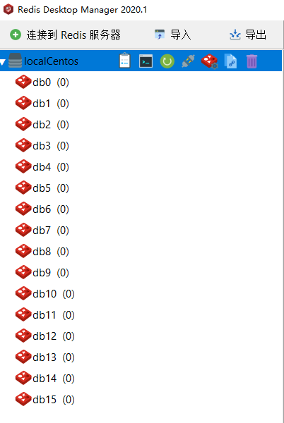

##　redis简介

简单来说 redis 就是一个数据库，不过与传统数据库不同的是 redis 的数据是存在内存中的，所以存写速度非常快，因

此 redis 被广泛应用于缓存方向。另外，redis 也经常用来做分布式锁。redis 提供了多种数据类型来支持不同的业

务场景。除此之外，redis 支持事务 、持久化、LUA脚本、LRU驱动事件、多种集群方案。

### 1.为什么要使用redis

为什么会有Redis呢？我放在map里面、list里面不是一样的嘛？反正都是放在内存里边。

单体不足以支持，使用多台服务器分摊用户请求。但问题也随之而来，在web app中，user如果首先访问application0，并在application中做完了登录；此时user的第二个请求被负载均衡到application1，我们照着原来的业务逻辑从Session中拿取user登录的信息，由于user是在application0机器登录的，appcation1能获取到application0的内存数据吗？明显不能，所以我们要在这种架构中保证每一个应用程序拿到的session都是一致的，也就是说，为了程序的正确性(用户只需要登录一次)，我们必须要把这些共享的数据放在一个地方存储，所以Redis来帮助我们解决这个问题。mysql也可以做到这种功能，但像这种经常访问的实时数据，更适合放在内存中，而不是放在磁盘中，要知道mysql的瓶颈就是磁盘I/O，此举无疑会增大mysql的压力，Redis作用是读写内存，内存读写速度对比磁盘读写速度不用说，那是一个天上一个地下，所以使用Redis的理由是：

1.**中心化存储，用于管理所有应用程序的共享数据**

2.**为关系型数据库缓解压力，因为Redis的吞吐量比mysql吞吐量大得多，热点数据、实时数据都可以用 Redis缓存。**

###　2.数据结构

redis是个key-value数据库。key是string类型的，value有5种基本数据类型还有其他高级类型，暂不介绍。

redis常用的五种数据类型：string（字符串），hash（哈希），list（列表），set（无序集合）及[zset](https://so.csdn.net/so/search?q=zset&spm=1001.2101.3001.7020)(有序集合)；

具体命令可以参考：https://blog.csdn.net/qq_44715376/article/details/123917109

#### 1.String

value其实不仅是String，也可以是数字。string 类型是二进制安全的。意思是 redis 的 string 可以包含任何数据。比如jpg图片或者序列化的对象。

#### 2.hash

**Hash** 是一个键值(key => value)对集合。Redis hash 是一个 string 类型的 field 和 value 的映射表，hash 特别适合用于存储对象。 

#### 3.list

**list** 列表是简单的字符串列表，按照插入顺序排序。你可以添加一个元素到列表的头部（左边）或者尾部（右边）。

使用List结构，我们可以轻松地实现最新消息排行等功能。List的另一个应用就是消息队列， 可以利用List的PUSH操作，将任务存在List中，然后工作线程再用POP操作将任务取出进行执行。Redis还提供了操作List中某一段的api，你可以直接查询，删除List中某一段的元素。

#### 4.Set

**set** 是string类型的无序集合。

应用场景：Redis set对外提供的功能与list类似是一个列表的功能，特殊之处在于set是可以自动排重的，当你需要存储一个列表数据，又不希望出现重复数据时，set是一个很好的选择，并且set提供了判断某个成员是否在一个set集合内的重要接口，这个也是list所不能提供的。

#### 5.ZSet

去重同时也可以排序.

使用场景：Redis sorted set的使用场景与set类似，区别是set不是自动有序的，而sorted set可以通过用户额外提供一个优先级(score)的参数来为成员排序，并且是插入有序的，即自动排序。

各个数据类型应用场景：

| 类型   | 简介                                                   | 特性                                                         | 场景                                                         |
| ------ | ------------------------------------------------------ | ------------------------------------------------------------ | ------------------------------------------------------------ |
| String | 二进制安全                                             | 可以包含任何数据，如序列化对象，一个键最大存储512m           |                                                              |
| Hash   | map类型                                                | 适合存储对象，可以像数据库中update一个属性一样只修改某一项属性值 | 存储、读取、修改用户属性                                     |
| List   | 双向链表                                               | 增删快，提供了操作某一段元素的API                            | 1、最新消息排行等功能(比如朋友圈的时间线) 2、消息队列        |
| Set    | 哈希表实现,元素不重复                                  | 为集合提供了求交集、并集、差集等操作                         | 1、共同好友 2、利用唯一性,统计访问网站的所有独立ip 3、好友推荐时,根据tag求交集,大于某个阈值就可以推荐 |
| ZSet   | 将Set中的元素增加一个权重参数score,元素按score有序排列 | 数据插入集合时,已经天然排序                                  | 1、排行榜 2、带权重的消息队列                                |

其他说明

使用的连接工具是`Redis Desktop Manager`,可以看到默认建立了16个库默认库0，而在集群环境下只有一个db0数据库。

每个数据库都有属于自己的空间，不必担心之间的key冲突。

参考：https://www.cnblogs.com/code-live/p/17239611.html