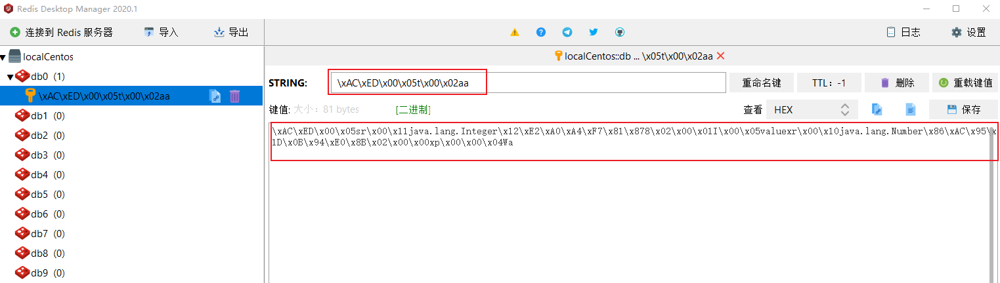
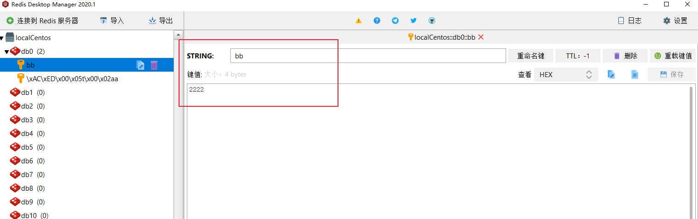
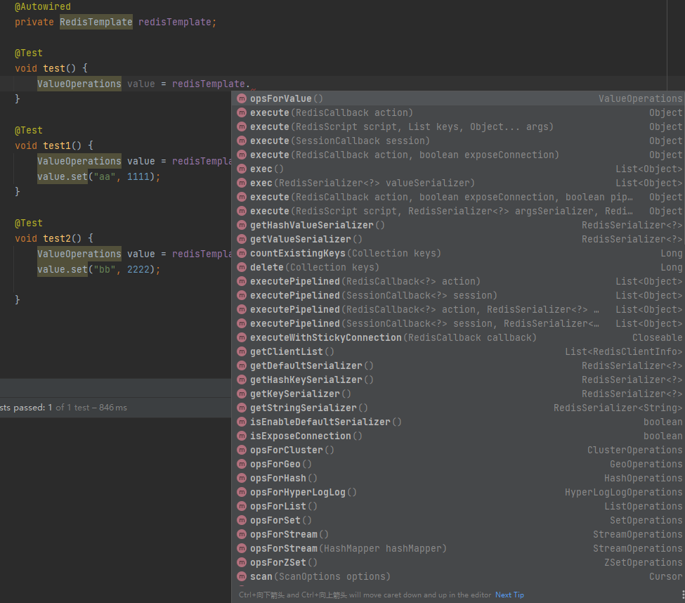
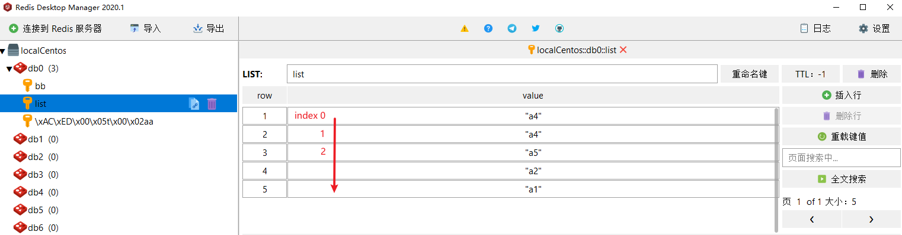
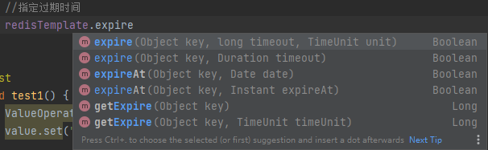

## springboot+redis整合

### 1.引入依赖

```shell
        <dependency>
            <groupId>org.springframework.boot</groupId>
            <artifactId>spring-boot-starter-data-redis</artifactId>
        </dependency>
```

### 2.配置连接

`application.yaml`

```yaml
spring:
  redis:
    port: 6379
    host: xxx
    password: xxx
```

### 3.测试使用

在test类直接测试`redisTemplate`

```java
@SpringBootTest
class RedisApplicationTests {
    @Autowired
    private RedisTemplate redisTemplate;

    @Test
    void test1() {
        ValueOperations value = redisTemplate.opsForValue();
        value.set("aa", 1111);
    }

}
```



可以看到redis默认以二进制存储键值对，我们可以对其序列化。

添加一个配置类，可以直接拿去使用。

`RedisConfig.java`

```java
package com.smallmayi.redis.config;

import com.fasterxml.jackson.annotation.JsonAutoDetect;
import com.fasterxml.jackson.annotation.PropertyAccessor;
import com.fasterxml.jackson.databind.ObjectMapper;
import com.fasterxml.jackson.databind.jsontype.impl.LaissezFaireSubTypeValidator;
import org.springframework.context.annotation.Bean;
import org.springframework.context.annotation.Configuration;
import org.springframework.data.redis.connection.RedisConnectionFactory;
import org.springframework.data.redis.core.RedisTemplate;
import org.springframework.data.redis.serializer.Jackson2JsonRedisSerializer;
import org.springframework.data.redis.serializer.StringRedisSerializer;

/**
 * @author smallmayi
 */
@Configuration
public class RedisConfig {
    @Bean
    public RedisTemplate<String, Object> redisTemplate(RedisConnectionFactory factory) {
        RedisTemplate<String, Object> template = new RedisTemplate<>();
        template.setConnectionFactory(factory);

        //创建 JSON 序列化器
        Jackson2JsonRedisSerializer jsonRedisSerializer = new Jackson2JsonRedisSerializer<>(Object.class);
        ObjectMapper om = new ObjectMapper();
        om.setVisibility(PropertyAccessor.ALL, JsonAutoDetect.Visibility.ANY);
        // 必须设置 否则无法将JSON转化为对象 会转化成Map类型
        om.activateDefaultTyping(LaissezFaireSubTypeValidator.instance, ObjectMapper.DefaultTyping.NON_FINAL);
        jsonRedisSerializer.setObjectMapper(om);

        //String序列化
        StringRedisSerializer stringRedisSerializer = new StringRedisSerializer();
        //key采用string的序列化方式
        template.setKeySerializer(stringRedisSerializer);
        //value的序列化方式采用jackson
        template.setValueSerializer(jsonRedisSerializer);
        //hash的key也采用String的序列化方式
        template.setHashKeySerializer(stringRedisSerializer);
        //hash的value序列化方式采用jackson
        template.setHashValueSerializer(jsonRedisSerializer);
        //初始化RedisTemplate
        template.afterPropertiesSet();

        return template;
    }

}
```

再次测试

```java
    @Test
    void test2() {
        ValueOperations value = redisTemplate.opsForValue();
        value.set("bb", 2222);
    }
```



可以看到`redis`里成功存储序列化数据。

### 4.redisTemplate详解



可以看到redisTemplate方法很多，下面介绍一下主要方法:

- REDISTEMPLATE对5种数据结构的操作

```java
redisTemplate.opsForValue();//操作字符串
 
redisTemplate.opsForHash();//操作hash
 
redisTemplate.opsForList();//操作list
 
redisTemplate.opsForSet();//操作set
 
redisTemplate.opsForZSet();//操作有序set
```

#### 1.String字符串操作

```java
//设置key和value值
redisTemplate.opsForValue().set("key","value");
//通过key获取value值
String result = redisTemplate.opsForValue().get("key").toString();
```

#### 2.list操作

```java
//添加数据
redisTemplate.opsForList().leftPush("list", "a1");
redisTemplate.opsForList().leftPush("list", "a2");
redisTemplate.opsForList().leftPush("list", "a3");
redisTemplate.opsForList().leftPush("list", "a4");

//指定位置插入数据
redisTemplate.opsForList().set("list", 1, "a4");
//在指定值后插入一个新值,没有就不操作
redisTemplate.opsForList().leftPush("list", "a2", "a5");

//获取指定位置value
String value = redisTemplate.opsForList().index("list", 1).toString();
//获取集合大小
Long size = redisTemplate.opsForList().size("list");
```



这里使用的是leftPush,每次从左边开始插入也就是头部，还有rightPush方法从右边插入值也就是尾部。

####　3.hash操作

```java
//添加数据
redisTemplate.opsForHash().put("hash","map1","value1");
redisTemplate.opsForHash().put("hash","map2","value2");

HashMap<String,String> hashMap = new HashMap<>();
hashMap.put("map3","value3");
hashMap.put("map4","value4");
redisTemplate.opsForHash().putAll("hash",hashMap);

//获取值
Object o = redisTemplate.opsForHash().get("hash", "map1");
System.out.println(o.toString());
```

#### 4.set操作

主要可以获取各个集合间的合集交集差值等。

```java
//添加数据
redisTemplate.opsForSet().add("set1","a1");
redisTemplate.opsForSet().add("set2","a2","a3","a4");
//获取key的值
Set set = redisTemplate.opsForSet().members("set");
System.out.println("set = " + set);

//key和otherKey的差值
Set difference = redisTemplate.opsForSet().difference("set1", "set2");
System.out.println(difference);
```

#### 5.zset操作

```java
//向指定key中添加元素，按照score值由小到大进行排列,集合中对应元素已存在，会被覆盖，包括score
redisTemplate.opsForZSet().add("zSet1","a1",1);
redisTemplate.opsForZSet().add("zSet2","a1",1);

//集合大小
Long zSet = redisTemplate.opsForZSet().size("zSet1");
System.out.println("zSet = " + zSet);
//key和otherKey的差值
Set difference = redisTemplate.opsForZSet().difference("zSet1", "set2");
System.out.println(difference);
```

其他具体方法参考：

redisTemplate五种数据处理详细方法：https://blog.csdn.net/weixin_43658899/category_11032320.html

### 5.redisTemplate直接方法

delete方法，有Object和Collection两种参数


expire指定和获取key的过期时间



判断key是否存在

```java
//判断key是否存在
redisTemplate.hasKey("set");
```

