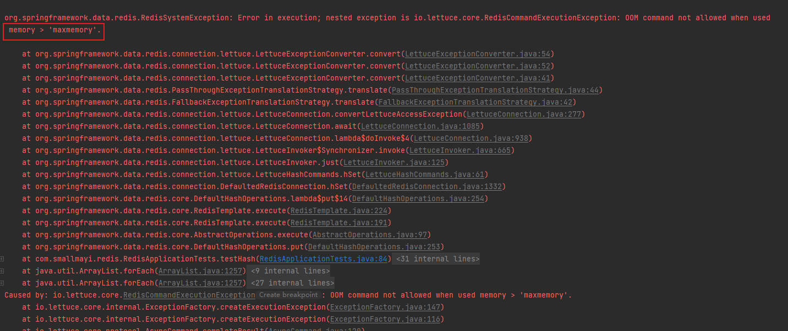
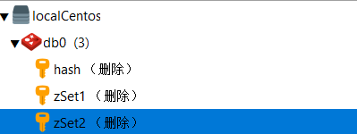
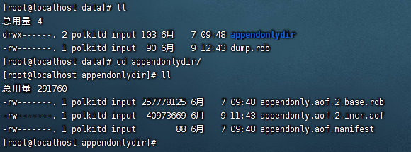
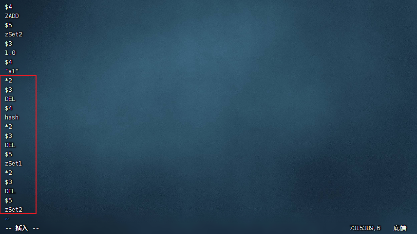

### 1.redis过期时间

默认redis不过期

### 2.默认内存

1、redis默认内存：如果不设置最大内存大小或者设置最大内存大小为0，在64位操作系统下不限制内存大小，在32位操作系统下最多使用3GB内存。linux系统可以通过`getconf LONG_BIT`命令查看位数。

2、生产上内存设置：一般推荐redis设置内存为最大物理内存的四分之三。
3、内存修改

通过redis.conf配置文件修改
格式：maxmemory  字节

设置maxmemory  后，超出后继续插入数据会报错OOM




### 3.内存淘汰机制

redis 内存淘汰机制有以下几个：

- noeviction: 当内存不足以容纳新写入数据时，新写入操作会报错。
- allkeys-lru：当内存不足以容纳新写入数据时，在键空间中，移除最近最少使用的 key（这个是最常用的）。
- allkeys-random：当内存不足以容纳新写入数据时，在键空间中，随机移除某个 key，这个一般没人用吧，为啥要随机，肯定是把最近最少使用的 key 给干掉啊。
- volatile-lru：当内存不足以容纳新写入数据时，在设置了过期时间的键空间中，移除最近最少使用的 key（这个一般不太合适）。
- volatile-random：当内存不足以容纳新写入数据时，在设置了过期时间的键空间中，随机移除某个 key。
- volatile-ttl：当内存不足以容纳新写入数据时，在设置了过期时间的键空间中，有更早过期时间的 key 优先移除。

配置过期策略

在redis.conf配置

```shell
#默认是noeviction
maxmemory-policy allkeys-lru
```

###　４．持久化策略

Redis默认开始RDB，AOF默认关闭

Redis持久化策略有两种：

一、RDB

**在单位时间间隔内将该时间点的数据集写入磁盘**


提供一个配置参数，支持周期性备份。

就像这样：

- save 900 1 # 900秒（15分钟）内有1个写入

- save 300 10 # 300秒（5分钟）内有10个写入

- save 60 10000 # 60秒（1分钟）内有10000个写入

  多个条件可以组合使用，只要上面一个条件满足，我就会去进行备份。

**优点与缺点**

1.比起AOF来说，RDB的优点是比较高效、恢复速度较快。

2.节省磁盘空间。

缺点：

1.最后一段时间内如果有新数据写入并且故障将会丢失这段时间内的数据。

2.在fork子进程时需要2倍的内存。

二、AOF

**在Redis执行写操作(set、del等)，不包括读操作(get等)，以日志的形式记录此操作，并将其append到文件中，Redis重启时会把记录下来的文件全部再执行一遍**

**优点与缺点**

优点：

1.AOF比起RDB来说明显AOF对数据的保障性更高，即丢失数据较少(根据appendfsync策略决定)，在always的情况下，最多丢失一秒钟的数据。

缺点：

1.AOF效率较低，且AOF文件通常比较大。

2.需要配合RDB一起使用，官网指名单独使用AOF可能出现BUG


**当 Redis 启动时， 如果 RDB 持久化和 AOF 持久化都被打开了， 那么程序会优先使用 AOF 文件来恢复数据集， 因为 AOF 文件所保存的数据通常是最完整的。**

## 备份 Redis 数据:

Redis 对于数据备份是非常友好的， 因为你可以在服务器运行的时候对 RDB 文件进行复制： RDB 文件一旦被创建， 就不会进行任何修改。 当服务器要创建一个新的 RDB 文件时， 它先将文件的内容保存在一个临时文件里面， 当临时文件写入完毕时， 程序才使用 原子地用临时文件替换原来的 RDB 文件。这也就是说， 无论何时， 复制 RDB 文件都是绝对安全的。

通过AOF恢复数据：



 这里我删除了三个key，



redis的data目录下appendonlydir目录，修改aof文件

`vim appendonly.aof.2.incr.aof`修改文件，将文件底端的删除命令删除,重启redis就能恢复了。




**持久化设置**

Redis默认开启RDB，AOF默认关闭

默认情况下如果15分钟内至少有一条数据更新，那么就会触发持久化生成*.rdb的二进制文件。

可以手动命令触发保存`save`或`bgsave`;

save命令是一个`同步`操作。当客户端向服务器发送 save 命令请求进行持久化时，服务器会阻塞 save 命令之后的其他客户端的请求，直到数据同步完成。如果数据量太大，同步数据会执行很久，这期间 Redis 服务器也无法接收其他请求，导致不可用。线上环境不建议使用。

bgsave命令是一个异步操作。当客户端发出 bgsave 命令时，Redis 服务器主进程会 fork 一个子进程，快照持久化完全交给子进程来处理，父进程继续处理客户端请求，子进程会在数据保存到 rdb 文件后退出。


也可以添加redis.conf参数来修改时间间隔

```shell
# 默认就是900s，15分钟
# 满足一条就触发
save 900 1
save 300 10
save 60 10000
```

**关闭RDB**

命令关闭：config set save ""

或配置文件redis.conf注释掉上面配置的触发间隔，配置

```shell
save ""
```

**开启AOF**

```shell
#开启AOF,默认no
appendonly yes 
```


参考：

https://blog.csdn.net/weixin_52489114/article/details/123011362

https://blog.csdn.net/An1090239782/article/details/127203348